# Dockerfile More example 

## java web app using tomcat 

### web server info 


## tomcat 

```
❯ ls
README.md       ashu.dockerfile myapp
❯ cat  ashu.dockerfile
FROM tomcat 
# we are using standard docker image from Docker hub 
MAINTAINER  ashutoshh
WORKDIR /usr/local/tomcat/webapps
# changing directory 
RUN mkdir app
WORKDIR app
ADD myapp  . 
#  add and copy both are same in dockerfile while add can except data from URL as well
RUN chmod 755  . -R

```
## building tomcat web image

```
❯ docker build  -t  tomcat:ashuv1 -f  ashu.dockerfile  .
Sending build context to Docker daemon  102.9kB
Step 1/8 : FROM tomcat
 ---> 345867df0879
Step 2/8 : MAINTAINER  ashutoshh
 ---> Using cache
 ---> 4f19547d56ff
Step 3/8 : WORKDIR /usr/local/tomcat/webapps
 ---> Using cache
 ---> 93a75a0c054b
Step 4/8 : RUN mkdir app
 ---> Using cache
 ---> 05e77f22df43
Step 5/8 : WORKDIR app
 ---> Using cache
 ---> d18b7c8b41c2
Step 6/8 : ADD myapp  .
 ---> Using cache
 ---> c5c6dde1dc0b
Step 7/8 : RUN chmod 755  . -R
 ---> Using cache
 ---> a1803b721f75
Step 8/8 : EXPOSE 8080
 ---> Running in ceeabf67b57e
Removing intermediate container ceeabf67b57e
 ---> 05713eefd125
Successfully built 05713eefd125
Successfully tagged tomcat:ashuv1

```

## login & push httpd image

```
4502  docker  build  -t  dockerashu/httpd:oraclejan2021v1  . 
❯ docker login  -u dockerashu
Password: 
Login Succeeded
❯ docker push  dockerashu/httpd:oraclejan2021v1
The push refers to repository [docker.io/dockerashu/httpd]
7b3988d1d6e0: Pushed 
143a4ef41fa2: Pushed 
2653d992f4ef: Mounted from library/centos 
oraclejan2021v1: digest: sha256:6d1372a6fbe11d5b5e4089c37ed8077e3b054c76c08f8cb0c5

```

## Networking 

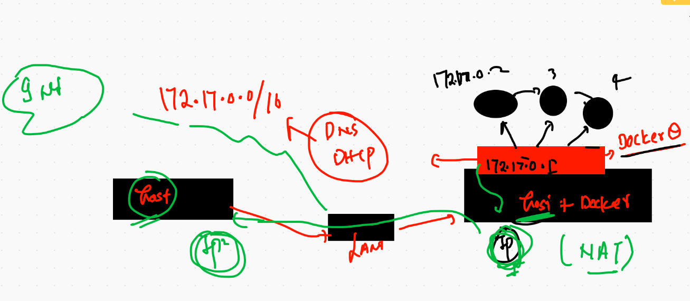

## Docker networks 

```
❯ docker network  ls
NETWORK ID     NAME      DRIVER    SCOPE
0d0902ba31e0   bridge    bridge    local
f3976dd88ab6   host      host      local
0e4420a12f63   none      null      local
❯ docker network inspect  0d0902ba31e0
[
    {
        "Name": "bridge",
        "Id": "0d0902ba31e0dbc783d1bf4b530e833b810c798d37dc8e768fcfc950d00ba878",
        "Created": "2021-01-27T03:59:07.647173596Z",
        "Scope": "local",
        "Driver": "bridge",
        "EnableIPv6": false,
        "IPAM": {
            "Driver": "default",
            "Options": null,
            "Config": [
                {
                    "Subnet": "172.17.0.0/16",
                    "Gateway": "172.17.0.1"
                }

```

## checking container interface 

```
❯ docker exec -it x1ashu sh
/ # ifconfig 
eth0      Link encap:Ethernet  HWaddr 02:42:AC:11:00:02  
          inet addr:172.17.0.2  Bcast:172.17.255.255  Mask:255.255.0.0
          UP BROADCAST RUNNING MULTICAST  MTU:1500  Metric:1
          RX packets:114 errors:0 dropped:0 overruns:0 frame:0
          TX packets:101 errors:0 dropped:0 overruns:0 carrier:0
          collisions:0 txqueuelen:0 
          RX bytes:10560 (10.3 KiB)  TX bytes:9498 (9.2 KiB)

lo        Link encap:Local Loopback  
          inet addr:127.0.0.1  Mask:255.0.0.0
          UP LOOPBACK RUNNING  MTU:65536  Metric:1
          RX packets:0 errors:0 dropped:0 overruns:0 frame:0
          TX packets:0 errors:0 dropped:0 overruns:0 carrier:0
          collisions:0 txqueuelen:1000 
          RX bytes:0 (0.0 B)  TX bytes:0 (0.0 B)
          
          
          
```

## custom bridge creation 

```
 4533  docker network create  ashubr1
 4534  docker network ls
 4535  docker network  inspect  ashubr1
❯ docker run -d --name c1  alpine ping fb.com
7c7e1c0d0feb85ab8ccd9ac800bbe4b145dcb7f6617c5b475aca4398ca0826ee
^Cdocke%                                                                                                                       ❯ docker rm c1 -f
c1
❯ 
❯ docker run -d --name c1 --network ashubr1   alpine ping fb.com
a4b9de6c2aa3a3f59f24750631ce6ab8c76f32a2a5eb42cf47d053b1f10efa19

❯ 
❯ docker run -d --name c2 --network ashubr1   alpine ping fb.com
f93ffc2f56d0f0106985f2561808f4819cd9d11ebfa22f0d6994c858eb75fad2
❯ 
❯ docker exec -it c1 sh
/ # ping c2 
PING c2 (172.18.0.3): 56 data bytes
64 bytes from 172.18.0.3: seq=0 ttl=255 time=0.127 ms
64 bytes from 172.18.0.3: seq=1 ttl=255 time=0.110 ms
64 bytes from 172.18.0.3: seq=2 ttl=255 time=0.113 ms
^C
--- c2 ping statistics ---
3 packets transmitted, 3 packets received, 0% packet loss
round-trip min/avg/max = 0.110/0.116/0.127 ms

```

## POrt forwarding 


## docker overlay networking using swarm 

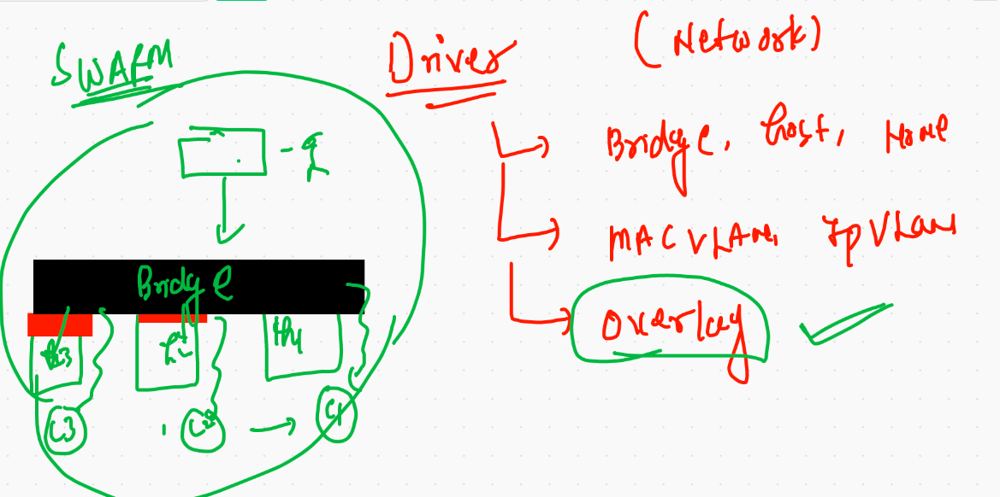

# storage in Docker & containers 

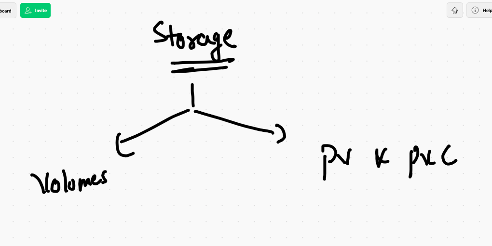

## for docker engine creating space 

```
[root@ip-172-31-43-246 ~]# mkfs.xfs   /dev/xvdf 
meta-data=/dev/xvdf              isize=512    agcount=4, agsize=2752512 blks
         =                       sectsz=512   attr=2, projid32bit=1
         =                       crc=1        finobt=1, sparse=0
data     =                       bsize=4096   blocks=11010048, imaxpct=25
         =                       sunit=0      swidth=0 blks
naming   =version 2              bsize=4096   ascii-ci=0 ftype=1
log      =internal log           bsize=4096   blocks=5376, version=2
         =                       sectsz=512   sunit=0 blks, lazy-count=1
realtime =none                   extsz=4096   blocks=0, rtextents=0
[root@ip-172-31-43-246 ~]# 
[root@ip-172-31-43-246 ~]# mkdir   /mnt/oracle
[root@ip-172-31-43-246 ~]# mount  /dev/xvdf  /mnt/oracle/
[root@ip-172-31-43-246 ~]# vim   /etc/fstab 
[root@ip-172-31-43-246 ~]# mount -a

```

## configuring docker engine 

```
[root@ip-172-31-43-246 ~]# cat  /etc/sysconfig/docker
# The max number of open files for the daemon itself, and all
# running containers.  The default value of 1048576 mirrors the value
# used by the systemd service unit.
DAEMON_MAXFILES=1048576

# Additional startup options for the Docker daemon, for example:
# OPTIONS="--ip-forward=true --iptables=true"
# By default we limit the number of open files per container
OPTIONS="--default-ulimit nofile=1024:4096  -H tcp://0.0.0.0:2375  -g  /mnt/oracle"

# How many seconds the sysvinit script waits for the pidfile to appear
# when starting the daemon.
DAEMON_PIDFILE_TIMEOUT=10

```


## loading services 

```
[root@ip-172-31-43-246 ~]# systemctl daemon-reload 
[root@ip-172-31-43-246 ~]# systemctl restart docker

```

## checking it 

```
❯ docker  info
Client:
 Context:    ashuaws
 Debug Mode: false
 Plugins:
  app: Docker App (Docker Inc., v0.9.1-beta3)
  buildx: Build with BuildKit (Docker Inc., v0.5.1-docker)
  scan: Docker Scan (Docker Inc., v0.5.0)

Server:
 Containers: 0
  Running: 0
  Paused: 0
  Stopped: 0
 Images: 0
 Server Version: 19.03.13-ce
 Storage Driver: overlay2
  Backing Filesystem: xfs
  Supports d_type: true
  Native Overlay Diff: true
 Logging Driver: json-file
 Cgroup Driver: cgroupfs
 Plugins:
  Volume: local
  Network: bridge host ipvlan macvlan null overlay
  Log: awslogs fluentd gcplogs gelf journald json-file local logentries splunk syslog
 Swarm: inactive
 Runtimes: runc
 Default Runtime: runc
 Init Binary: docker-init
 containerd version: c623d1b36f09f8ef6536a057bd658b3aa8632828
 runc version: ff819c7e9184c13b7c2607fe6c30ae19403a7aff
 init version: de40ad0 (expected: fec3683)
 Security Options:
  seccomp
   Profile: default
 Kernel Version: 4.14.209-160.339.amzn2.x86_64
 Operating System: Amazon Linux 2
 OSType: linux
 Architecture: x86_64
 CPUs: 2
 Total Memory: 3.85GiB
 Name: ip-172-31-43-246.ec2.internal
 ID: 4MIK:ZUZD:J3FL:SBMM:YOIK:Y4YP:RIPI:6VFS:4IG5:F2MS:2NBY:E6DH
 Docker Root Dir: /mnt/oracle

```


## restoring old location data to new location 

```
 13  rsync -avp  /var/lib/docker/  /mnt/oracle/
   14  systemctl restart docker 
   
```

## contaier storage

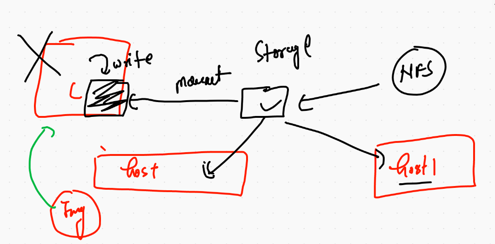

## checking ephemral nature of container 

```
❯ docker run  -ti  --rm   alpine  sh
/ # ls
bin    dev    etc    home   lib    media  mnt    opt    proc   root   run    sbin   srv    sys    tmp    usr    var
/ # cat  /etc/os-release 
NAME="Alpine Linux"
ID=alpine
VERSION_ID=3.13.0
PRETTY_NAME="Alpine Linux v3.13"
HOME_URL="https://alpinelinux.org/"
BUG_REPORT_URL="https://bugs.alpinelinux.org/"
/ # mkdir hello ashutoshh
/ # ls
ashutoshh  dev        hello      lib        mnt        proc       run        srv        tmp        var
bin        etc        home       media      opt        root       sbin       sys        usr
/ # echo hiii  >a.txt 
/ # ls
a.txt      bin        etc        home       media      opt        root       sbin       sys        usr
ashutoshh  dev        hello      lib        mnt        proc       run        srv        tmp        var
/ # 
❯ docker run  -ti  --rm   alpine  sh
/ # ls
bin    dev    etc    home   lib    media  mnt    opt    proc   root   run    sbin   srv    sys    tmp    usr    var
/ # 


```
## volume with container play

```
❯ docker  volume  create  ashuvol1
ashuvol1
❯ docker  volume  ls
DRIVER    VOLUME NAME
local     ashuvol1
❯ docker  volume  ls
DRIVER    VOLUME NAME
local     ashuvol1
local     vivek1
❯ docker  volume  ls
DRIVER    VOLUME NAME
local     ashuvol1
local     venkvol
local     vivek1
❯ docker run  -ti  --name ashux1 -v  ashuvol1:/data:rw    alpine  sh
/ # ls
bin    data   dev    etc    home   lib    media  mnt    opt    proc   root   run    sbin   srv    sys    tmp    usr    var
/ # cd  data/
/data # ls
/data # mkdir hello world 
/data # ls
hello  world
/data # exit
❯ docker  rm  ashux1
ashux1
❯ docker  volume  ls
DRIVER    VOLUME NAME
local     ashuvol1
local     manjuvol1
local     niranv1
local     venkvol
local     vivek1
❯ docker  volume  inspect  ashuvol1
[
    {
        "CreatedAt": "2021-01-27T06:57:53Z",
        "Driver": "local",
        "Labels": {},
        "Mountpoint": "/mnt/oracle/volumes/ashuvol1/_data",
        "Name": "ashuvol1",
        "Options": {},
        "Scope": "local"
    }
]
❯ docker run  -ti  --name ashux1 -v  ashuvol1:/data:rw    oraclelinux:8.3  bash
Unable to find image 'oraclelinux:8.3' locally
8.3: Pulling from library/oraclelinux
989beddc1550: Pull complete 
Digest: sha256:2bb4ec43d6f9fca620f73eda8d924d4c17ab4672b23a76b518a92cb32507bdd1
Status: Downloaded newer image for oraclelinux:8.3
[root@5b60d4acd47f /]# 
[root@5b60d4acd47f /]# 
[root@5b60d4acd47f /]# ls
bin  boot  data  dev  etc  home  lib  lib64  media  mnt  opt  proc  root  run  sbin  srv  sys  tmp  usr  var
[root@5b60d4acd47f /]# cd  data/
[root@5b60d4acd47f data]# ls
hello  world

```
## docker volume 

```
4560  docker  volume  create  ashuvol1 
 4561  docker  volume  ls
 4562  docker run  -ti  --name ashux1 -v  ashuvol1:/data:rw    alpine  sh  
 4563  docker  rm  ashux1 
 4564  docker  volume  ls
 4565  docker  volume  inspect  ashuvol1 
 4566  docker run  -ti  --name ashux1 -v  ashuvol1:/data:rw    oraclelinux:8.3  bash   
 4567  docker run  -ti  --name ashux2 -v  ashuvol1:/data1:rw  -v  ashuvol2:/me:ro     oraclelinux:8.3  bash   
 4568  docker  volume ls
 4569  docker run  -ti  --name ashux3  -v  /etc:/me:ro     oraclelinux:8.3  bash   
 4570  history
 4571  cd Desktop
 4572  ls
 4573  cd oraclejan252021
 4574  ls
 4575  mv beginner-html-site-styled   htmlapp
 4576  ls
 4577  pwd
 4578  docker run -d --name x4 -v  /Users/fire/Desktop/oraclejan252021/htmlapp:/usr/share/nginx/html  -p 1188:80 nginx 
 ```
 
 ## portainer as volume 
 
``` 
 ❯ docker run -d --name webui -p 9000:9000  -v  /var/run/docker.sock:/var/run/docke.sock portainer/portainer
Unable to find image 'portainer/portainer:latest' locally
latest: Pulling from portainer/portainer
d1e017099d17: Pull complete 
717377b83d5c: Pull complete 
Digest: sha256:f8c2b0a9ca640edf508a8a0830cf1963a1e0d2fd9936a64104b3f658e120b868
Status: Downloaded newer image for portainer/portainer:latest
b47a9eb40990b4a9d255a25574600677630d009dbdb1e483d11546ba9311ba41
❯ docker ps
CONTAINER ID   IMAGE                 COMMAND                  CREATED          STATUS          PORTS                    NAMES
b47a9eb40990   portainer/portainer   "/portainer"             8 seconds ago    Up 6 seconds    0.0.0.0:9000->9000/tcp   webui
677908b09c49   alpine                "sh"                     3 minutes ago    Up 3 minutes                             niranx3
4a17db91c757   nginx                 "/docker-entrypoint.…"   6 minutes ago    Up 6 minutes    0.0.0.0:1188->80/tcp     x4
9d6a9c0e18a3   alpine                "sh"                     11 minutes ago   Up 11 minutes                            viveks

```

##  image layer discussion 

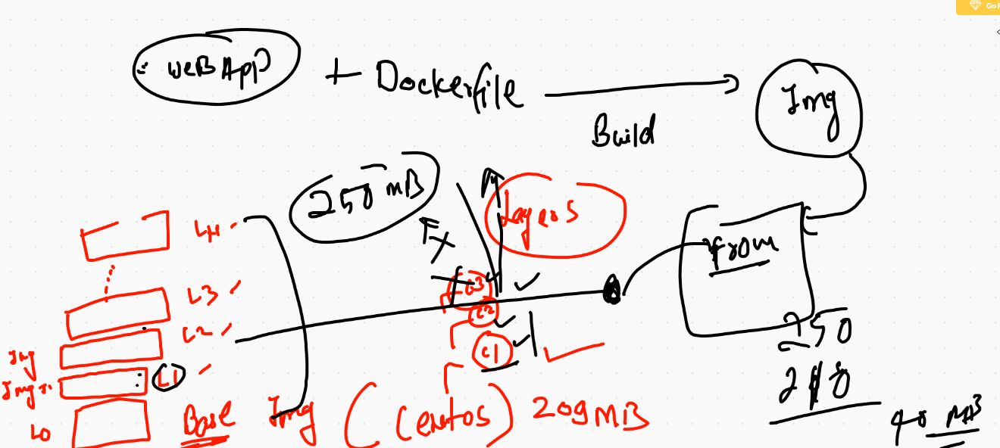


## PROBlem in container based app hosting 

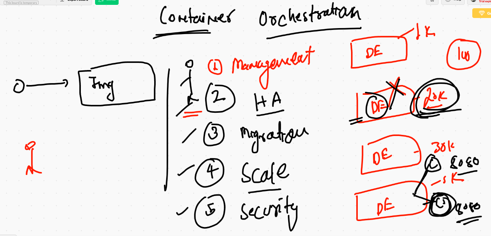

## container orchestration tools and tech 

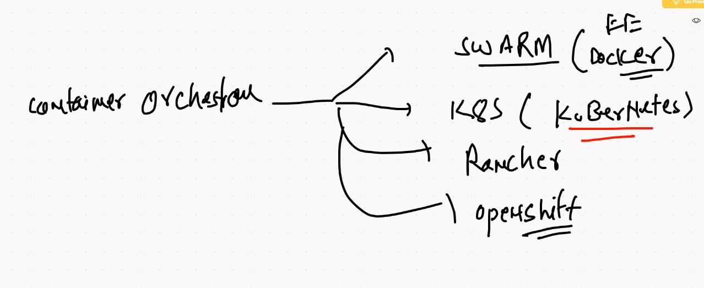

# k8s Intro 

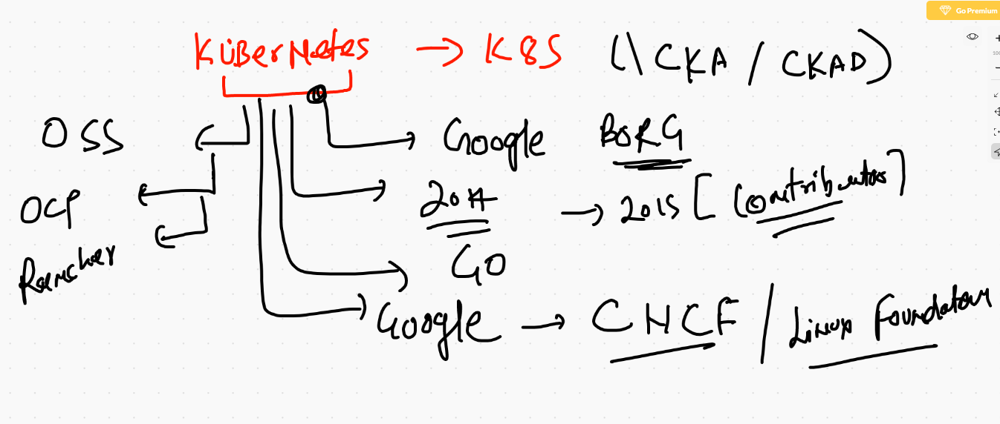

## k8s master component 

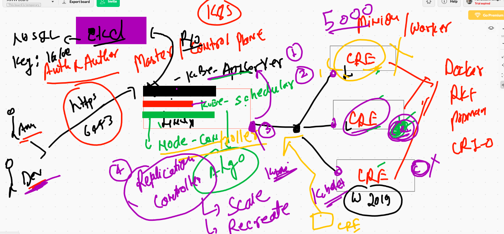

## minion node 

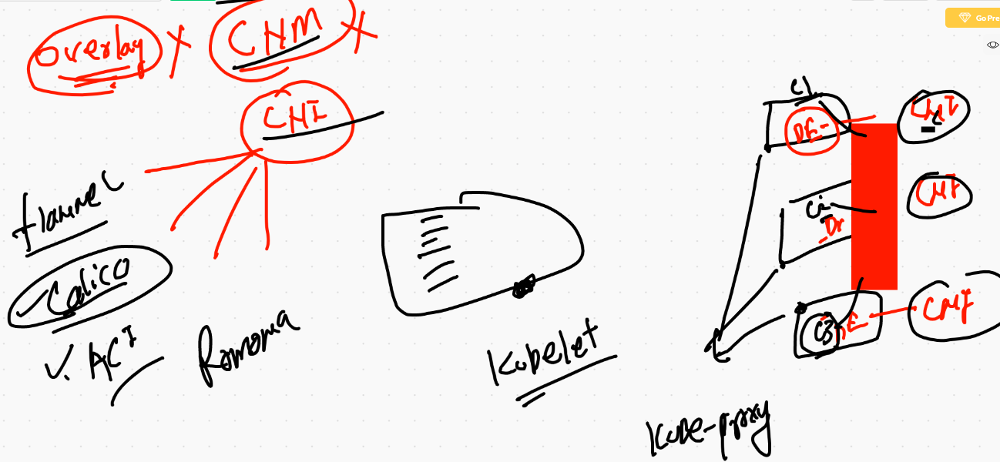

## deployment of k8s cluster 

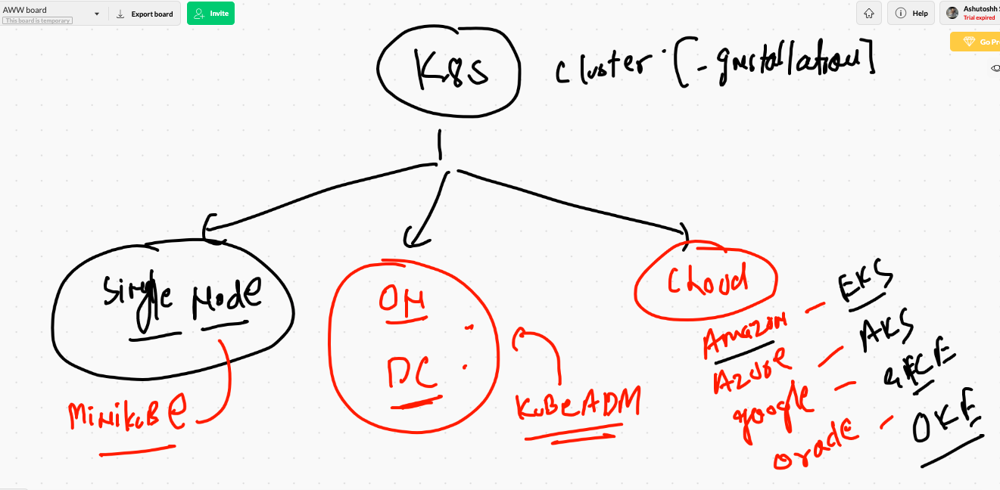

## minikube installation 

```
https://minikube.sigs.k8s.io/docs/start/
```

## checking minikube version 

```
❯ minikube  version
minikube version: v1.17.0
commit: 7e8b5a89575945ba8f8246bfe547178c1a995198

```

## minikube cluster 

```
❯ minikube start  --driver=docker
😄  minikube v1.17.0 on Darwin 11.1
✨  Using the docker driver based on user configuration
👍  Starting control plane node minikube in cluster minikube
🚜  Pulling base image ...
💾  Downloading Kubernetes v1.20.2 preload ...
    > preloaded-images-k8s-v8-v1....: 491.22 MiB / 491.22 MiB  100.00% 3.04 MiB
🔥  Creating docker container (CPUs=2, Memory=1989MB) ...
🐳  Preparing Kubernetes v1.20.2 on Docker 20.10.2 ...
    ▪ Generating certificates and keys ...
    ▪ Booting up control plane ...
    ▪ Configuring RBAC rules ...
🔎  Verifying Kubernetes components...
🌟  Enabled addons: storage-provisioner, default-storageclass
🏄  Done! kubectl is now configured to use "minikube" cluster and "default" namespace by default
❯ minikube status
minikube
type: Control Plane
host: Running
kubelet: Running
apiserver: Running
kubeconfig: Configured
timeToStop: Nonexistent

❯ minikube ip
192.168.49.2
❯ minikube stop
✋  Stopping node "minikube"  ...
🛑  Powering off "minikube" via SSH ...
🛑  1 nodes stopped.
❯ minikube start
😄  minikube v1.17.0 on Darwin 11.1
✨  Using the docker driver based on existing profile
👍  Starting control plane node minikube in cluster minikube
🔄  Restarting existing docker container for "minikube" ...
🐳  Preparing Kubernetes v1.20.2 on Docker 20.10.2 ...
🔎  Verifying Kubernetes components...
🌟  Enabled addons: storage-provisioner, default-storageclass
🏄  Done! kubectl is now configured to use "minikube" cluster and "default" namespace by default
❯ minikube status
minikube
type: Control Plane
host: Running
kubelet: Running
apiserver: Running
kubeconfig: Configured
timeToStop: Nonexistent

❯ minikube  ssh
docker@minikube:~$ 
docker@minikube:~$ exit
logout


```


## Installing kubectl that is k8s client 

```
❯ curl -LO "https://dl.k8s.io/release/$(curl -L -s https://dl.k8s.io/release/stable.txt)/bin/darwin/amd64/kubectl"
  % Total    % Received % Xferd  Average Speed   Time    Time     Time  Current
                                 Dload  Upload   Total   Spent    Left  Speed
100   161  100   161    0     0    404      0 --:--:-- --:--:-- --:--:--   403
100 44.0M  100 44.0M    0     0  4777k      0  0:00:09  0:00:09 --:--:-- 7023k
❯ chmod +x ./kubectl
❯ sudo mv ./kubectl /usr/local/bin/kubectl
Password:
❯ kubectl version --client
Client Version: version.Info{Major:"1", Minor:"20", GitVersion:"v1.20.2", GitCommit:"faecb196815e248d3ecfb03c680a4507229c2a56", GitTreeState:"clean", BuildDate:"2021-01-13T13:28:09Z", GoVersion:"go1.15.5", Compiler:"gc", Platform:"darwin/amd64"}

```


## link of kubectl 

[link] ('https://kubernetes.io/docs/tasks/tools/install-kubectl/')

## connecting to minikube cluster 

```
❯ kubectl  get   nodes
NAME       STATUS   ROLES                  AGE   VERSION
minikube   Ready    control-plane,master   47m   v1.20.2
❯ kubectl cluster-info
Kubernetes control plane is running at https://127.0.0.1:55020
KubeDNS is running at https://127.0.0.1:55020/api/v1/namespaces/kube-system/services/kube-dns:dns/proxy

To further debug and diagnose cluster problems, use 'kubectl cluster-info dump'.

```

## kubectl to  k8s cluster 

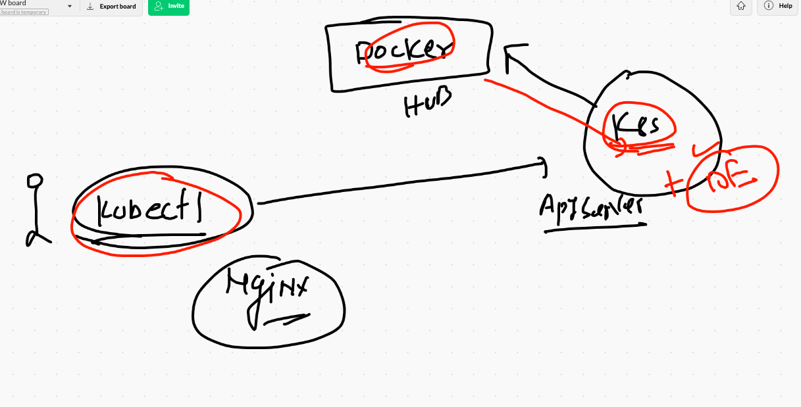


## kubectl to POD

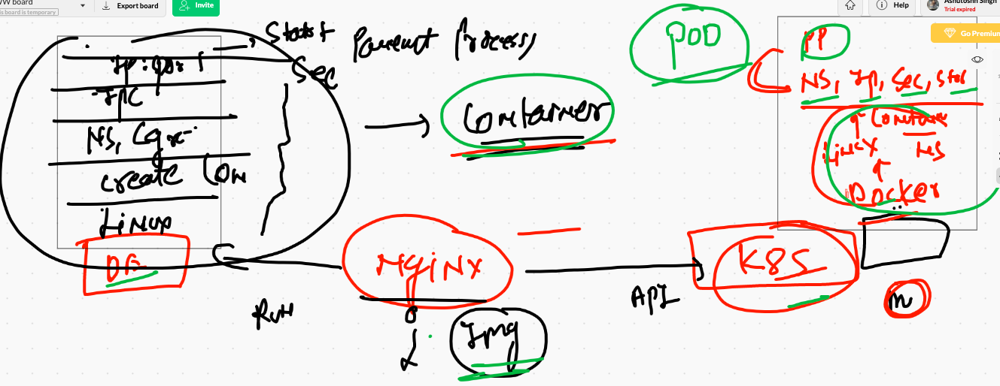

## creating containers 

```
❯ kubectl apply -f ashupod.yaml --dry-run=client
pod/ashu-pod-1 created (dry run)
❯ kubectl apply -f ashupod.yaml
pod/ashu-pod-1 created
❯ kubectl  get po
NAME         READY   STATUS              RESTARTS   AGE
ashu-pod-1   0/1     ContainerCreating   0          4s
❯ kubectl  get pod
NAME         READY   STATUS              RESTARTS   AGE
ashu-pod-1   0/1     ContainerCreating   0          8s
❯ kubectl  get pod
NAME         READY   STATUS              RESTARTS   AGE
ashu-pod-1   0/1     ContainerCreating   0          14s
❯ kubectl  get pod
NAME         READY   STATUS              RESTARTS   AGE
ashu-pod-1   0/1     ContainerCreating   0          23s
❯ kubectl  get pod  -w
NAME         READY   STATUS              RESTARTS   AGE
ashu-pod-1   0/1     ContainerCreating   0          26s
ashu-pod-1   1/1     Running             0          32s
^C%                                                                                                                            ❯ kubectl  get pod
NAME         READY   STATUS    RESTARTS   AGE
ashu-pod-1   1/1     Running   0          37s

```


## describe pod 

```
❯ kubectl  describe pod ashu-pod-1
Name:         ashu-pod-1
Namespace:    default
Priority:     0
Node:         minikube/192.168.49.2
Start Time:   Wed, 27 Jan 2021 16:55:46 +0530
Labels:       <none>
Annotations:  <none>
Status:       Running
IP:           172.17.0.3
IPs:
  IP:  172.17.0.3
Containers:
  ashuc1:
    Container ID:   docker://f19a7c4092a5f4b89dd2751e6ca2e890063025a415bf781b1172585b53ecb7b9
    Image:          nginx
    Image ID:       docker-pullable://nginx@sha256:10b8cc432d56da8b61b070f4c7d2543a9ed17c2b23010b43af434fd40e2ca4aa
    Port:           80/TCP
    Host Port:      0/TCP
    State:          Running

```

## to access application using client 

```
 kubectl port-forward  ashu-pod-1  2233:80
Forwarding from 127.0.0.1:2233 -> 80
Forwarding from [::1]:2233 -> 80
Handling connection for 2233
Handling connection for 2233

```

## auto generate yaml / json 

```
❯ kubectl  run  ashupod2  --image=nginx  --port 80 --dry-run=client
pod/ashupod2 created (dry run)
❯ kubectl  run  ashupod2  --image=nginx  --port 80 --dry-run=client  -o yaml
apiVersion: v1
kind: Pod
metadata:
  creationTimestamp: null
  labels:
    run: ashupod2
  name: ashupod2
spec:
  containers:
  - image: nginx
    name: ashupod2
    ports:
    - containerPort: 80
    resources: {}
  dnsPolicy: ClusterFirst
  restartPolicy: Always
status: {}
❯ kubectl  run  ashupod2  --image=nginx  --port 80 --dry-run=client  -o json
{
    "kind": "Pod",
    "apiVersion": "v1",
    "metadata": {
        "name": "ashupod2",
        "creationTimestamp": null,
        "labels": {
            "run": "ashupod2"
        }
    },
    "spec": {
        "containers": [
            {
                "name": "ashupod2",
                "image": "nginx",
                "ports": [
                    {
                        "containerPort": 80
                    }
                ],
                "resources": {}
            }
        ],
        "restartPolicy": "Always",
        "dnsPolicy": "ClusterFirst"


```

## store yaml 

```
kubectl  run  ashupod2  --image=nginx  --port 80 --dry-run=client  -o yaml  >pod2.yml

```

