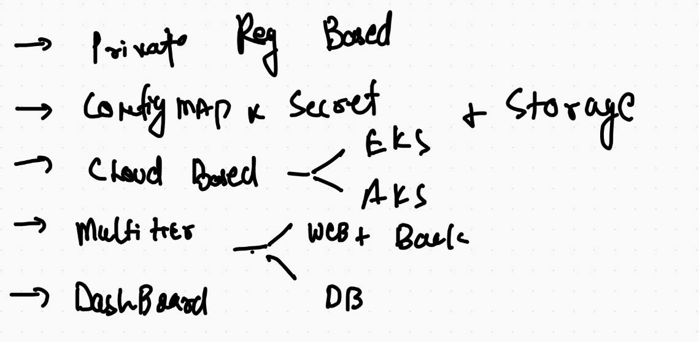
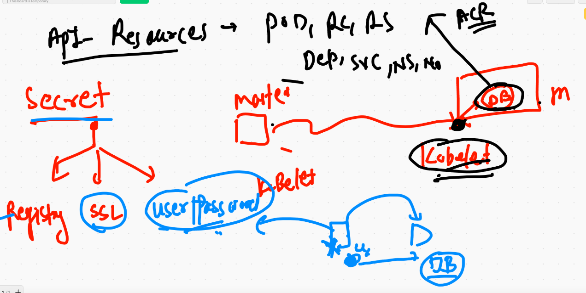
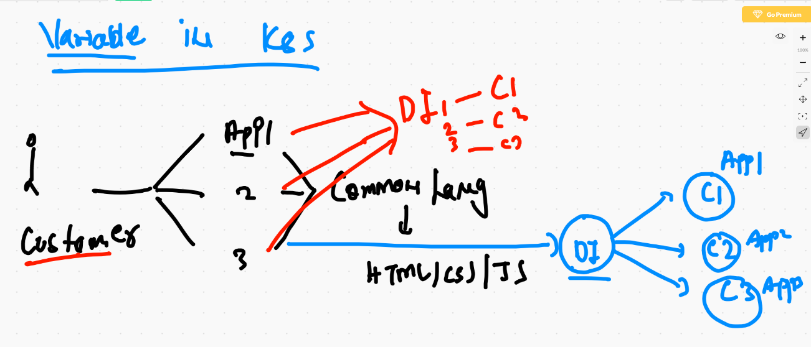

# final Day outline 



## lets set default namesapce 

```
kubectl  config set-context  --current --namespace=ashu-space
```

# intro to api-resources and secret



# multi application container image



## Dockerfile 

```
❯ cat Dockerfile
FROM  oraclelinux:8.3
MAINTAINER  ashutoshh@linux.com
RUN yum  install httpd -y
RUN mkdir /data   /data/web1   /data/web2  /data/web3 
ENV customer=app
COPY app1  /data/web1/
COPY app2  /data/web2/
COPY app3  /data/web3/
COPY deploy.sh  /data/deploy.sh 
WORKDIR /data
RUN chmod +x deploy.sh 
EXPOSE 80
ENTRYPOINT ["./deploy.sh"]

# note HTTPd  server is reading webapps from /var/www/html 

```

## shell script 

```
❯ cat deploy.sh
#!/bin/bash

if  [  "$customer" == "app1"  ]
then
 cp -rvf  /data/web1/*  /var/www/html/
 httpd -DFOREGROUND 

elif  [  "$customer" == "app2"  ]
then
 cp -rvf /data/web2/*  /var/www/html/
 httpd -DFOREGROUND 

elif  [  "$customer" == "app3"  ]
then
 cp -rvf /data/web3/*  /var/www/html/
 httpd -DFOREGROUND


else 
	echo  "Hello this page in not HERE : its a 404 error "  >/var/www/html/index.html
	httpd -DFOREGROUND 

fi 

```

## .dockerignore 

```
❯ cat .dockerignore
Dockerfile
.dockerignore
app1/*.md
app1/LICENSE
app1/.git

app2/*.md
app2/LICENSE
app2/.git


app3/*.md
app3/LICENSE
app3/.git

```
## building docker image 

```
docker build -t  dockerashu/mywebapp:oraclejan2021  .
```


## deployment of app1 for customer  

```
kubectl  create  deployment  multidep --image=dockerashu/mywebapp:oraclejan2021  --dry-run=client -o yaml >multi.yml

```

## creating configMap 

```
5006  kubectl  create  configmap ashucm --from-literal  x=app1  --from-literal y=app2  --from-literal z=app3 
 5007  kubectl  get  cm 
 5008  kubectl describe cm ashucm 
```

##  app1 

```
❯ kubectl  apply -f  multi.yml
deployment.apps/multidep created
❯ kubectl  get  deploy
NAME       READY   UP-TO-DATE   AVAILABLE   AGE
multidep   0/1     1            0           5s
❯ 
❯ 
❯ kubectl get  rs
NAME                 DESIRED   CURRENT   READY   AGE
multidep-96f487778   1         1         1       11s
❯ 
❯ 
❯ kubectl  get  po
NAME                       READY   STATUS    RESTARTS   AGE
ashuprvpod                 1/1     Running   0          56m
multidep-96f487778-kctkp   1/1     Running   0          15s
❯ kubectl expose deployment multidep --type NodePort  --port 1244 --target-port 80 --name app1svc1
service/app1svc1 exposed
❯ kubectl get  svc
NAME       TYPE       CLUSTER-IP      EXTERNAL-IP   PORT(S)          AGE
app1svc1   NodePort   10.99.194.246   <none>        1244:31067/TCP   9s

```


