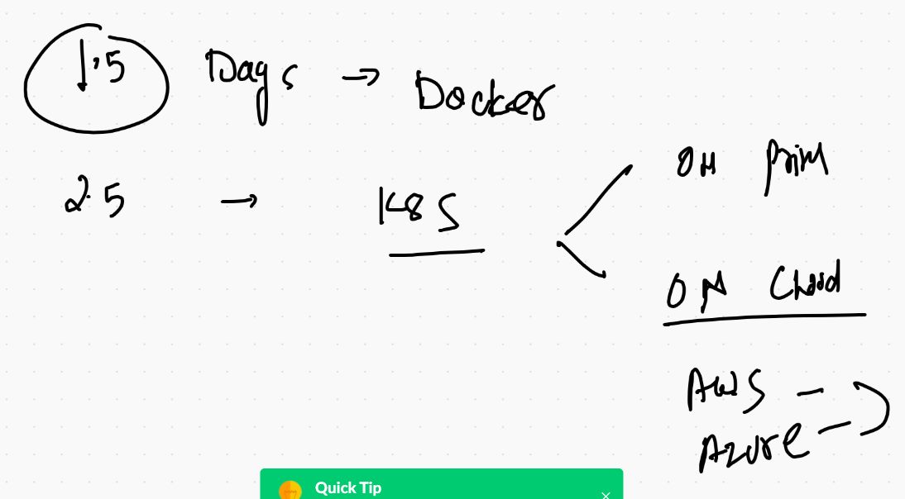
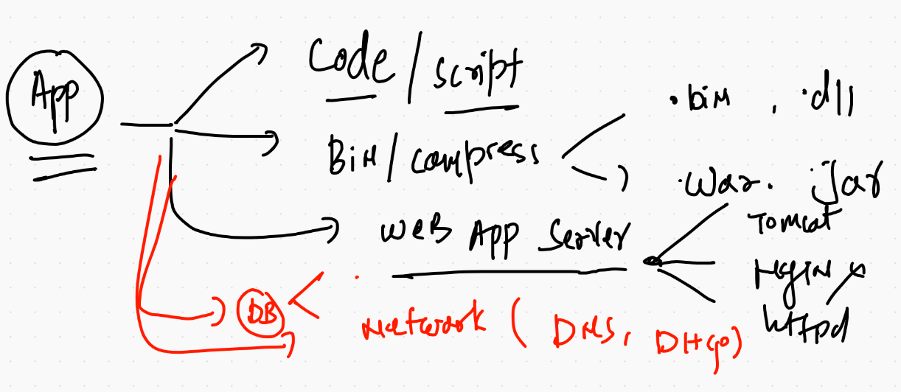
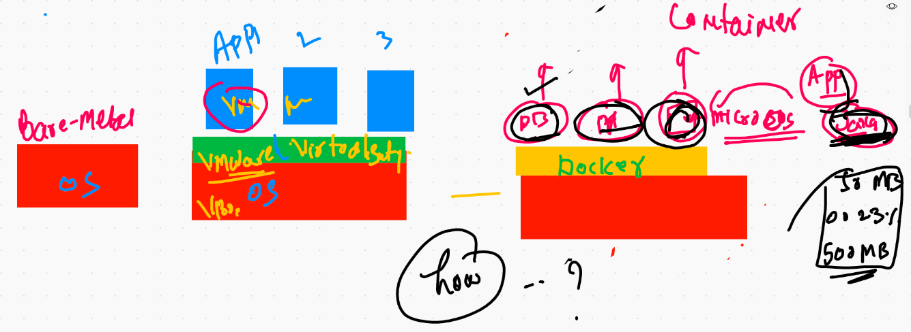
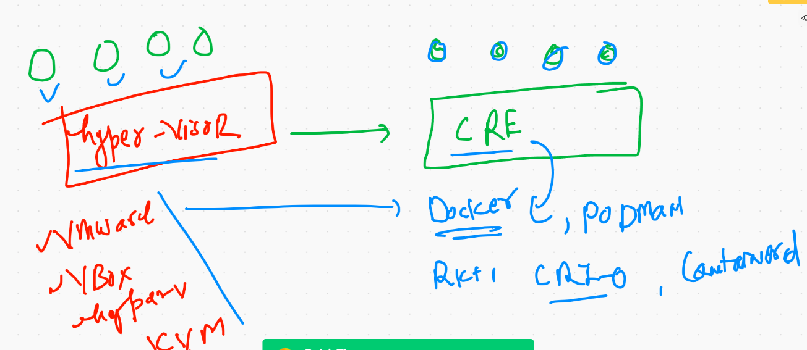
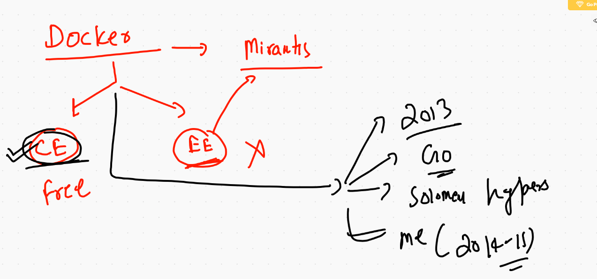
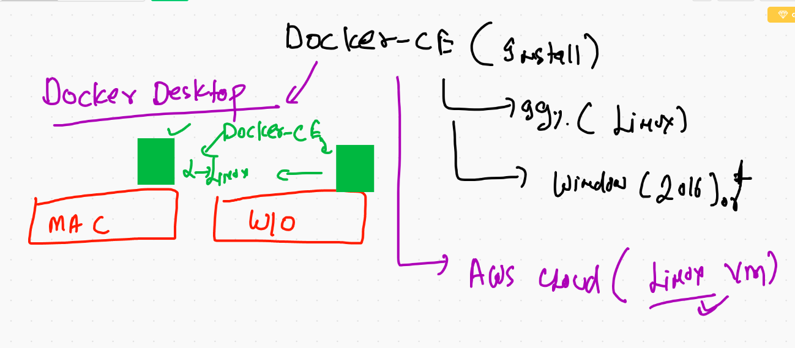

# Session planning 

## app 

## app deployment history and future 

## Vms and containers options 

## info about docker 

## Docker installation 

## Docker Desktop URLS 

[Windows 10] ('https://hub.docker.com/editions/community/docker-ce-desktop-windows/')

---

[mac OS] ('https://hub.docker.com/editions/community/docker-ce-desktop-mac')
