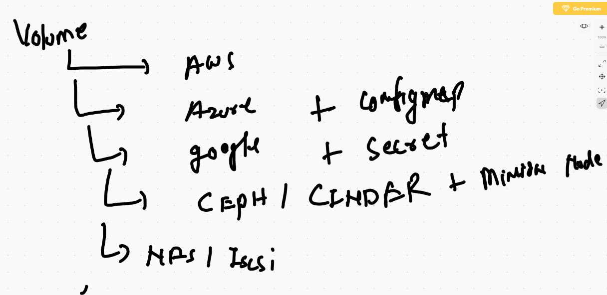
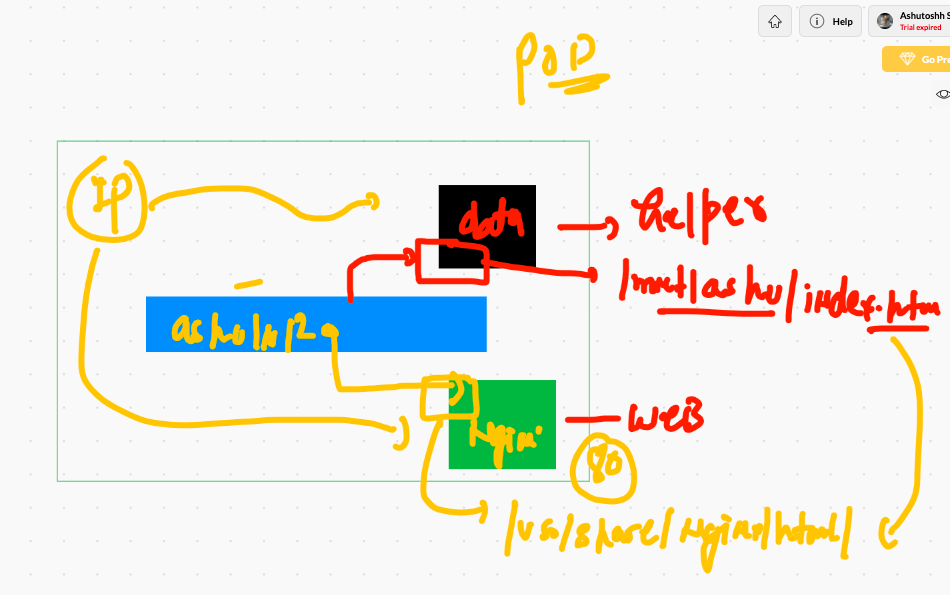
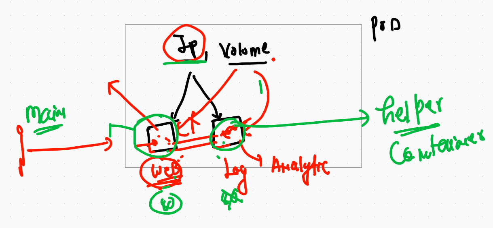
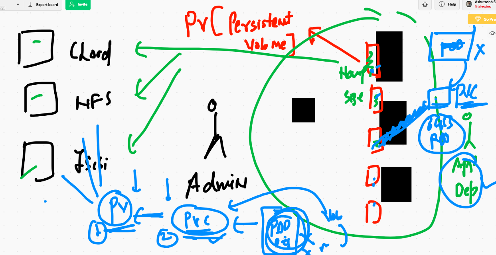

# final Day outline 


## lets set default namesapce 

```
kubectl  config set-context  --current --namespace=ashu-space
```

# intro to api-resources and secret


# multi application container image


## Dockerfile 

```
❯ cat Dockerfile
FROM  oraclelinux:8.3
MAINTAINER  ashutoshh@linux.com
RUN yum  install httpd -y
RUN mkdir /data   /data/web1   /data/web2  /data/web3 
ENV customer=app
COPY app1  /data/web1/
COPY app2  /data/web2/
COPY app3  /data/web3/
COPY deploy.sh  /data/deploy.sh 
WORKDIR /data
RUN chmod +x deploy.sh 
EXPOSE 80
ENTRYPOINT ["./deploy.sh"]

# note HTTPd  server is reading webapps from /var/www/html 

```

## shell script 

```
❯ cat deploy.sh
#!/bin/bash

if  [  "$customer" == "app1"  ]
then
 cp -rvf  /data/web1/*  /var/www/html/
 httpd -DFOREGROUND 

elif  [  "$customer" == "app2"  ]
then
 cp -rvf /data/web2/*  /var/www/html/
 httpd -DFOREGROUND 

elif  [  "$customer" == "app3"  ]
then
 cp -rvf /data/web3/*  /var/www/html/
 httpd -DFOREGROUND


else 
	echo  "Hello this page in not HERE : its a 404 error "  >/var/www/html/index.html
	httpd -DFOREGROUND 

fi 

```

## .dockerignore 

```
❯ cat .dockerignore
Dockerfile
.dockerignore
app1/*.md
app1/LICENSE
app1/.git

app2/*.md
app2/LICENSE
app2/.git


app3/*.md
app3/LICENSE
app3/.git

```
## building docker image 

```
docker build -t  dockerashu/mywebapp:oraclejan2021  .
```


## deployment of app1 for customer  

```
kubectl  create  deployment  multidep --image=dockerashu/mywebapp:oraclejan2021  --dry-run=client -o yaml >multi.yml

```

## creating configMap 

```
5006  kubectl  create  configmap ashucm --from-literal  x=app1  --from-literal y=app2  --from-literal z=app3 
 5007  kubectl  get  cm 
 5008  kubectl describe cm ashucm 
```
## yaml of app1 

```
apiVersion: apps/v1
kind: Deployment
metadata:
  creationTimestamp: null
  labels:
    app: multidep
  name: multidep # for first application deployment 
spec:
  replicas: 1
  selector:
    matchLabels:
      app: multidep
  strategy: {}
  template:
    metadata:
      creationTimestamp: null
      labels:
        app: multidep
    spec:
      containers:
      - image: dockerashu/mywebapp:oraclejan2021
        name: mywebapp
        env: # for defining env var
        - name: customer # name of env var from dockerfile 
          valueFrom:
           configMapKeyRef:
            name: ashucm  # name of configMap 
            key: x # key from ashucm config map 
        resources: {}
status: {}


```


##  app1 

```
❯ kubectl  apply -f  multi.yml
deployment.apps/multidep created
❯ kubectl  get  deploy
NAME       READY   UP-TO-DATE   AVAILABLE   AGE
multidep   0/1     1            0           5s
❯ 
❯ 
❯ kubectl get  rs
NAME                 DESIRED   CURRENT   READY   AGE
multidep-96f487778   1         1         1       11s
❯ 
❯ 
❯ kubectl  get  po
NAME                       READY   STATUS    RESTARTS   AGE
ashuprvpod                 1/1     Running   0          56m
multidep-96f487778-kctkp   1/1     Running   0          15s
❯ kubectl expose deployment multidep --type NodePort  --port 1244 --target-port 80 --name app1svc1
service/app1svc1 exposed
❯ kubectl get  svc
NAME       TYPE       CLUSTER-IP      EXTERNAL-IP   PORT(S)          AGE
app1svc1   NodePort   10.99.194.246   <none>        1244:31067/TCP   9s

```

# storage in k8s

## type of storage resources 


## storage plugins in k8s 



# EmptyDir volume 

```
❯ kubectl  run  emppod --image=alpine --dry-run=client -o yaml
apiVersion: v1
kind: Pod
metadata:
  creationTimestamp: null
  labels:
    run: emppod
  name: emppod
spec:
  containers:
  - image: alpine
    name: emppod
    resources: {}
  dnsPolicy: ClusterFirst
  restartPolicy: Always
status: {}
❯ kubectl  run  emppod --image=alpine --dry-run=client -o yaml   >emppod.yaml


```

# multi container POD 

```
apiVersion: v1
kind: Pod
metadata:
  creationTimestamp: null
  labels:
    run: emppod1
  name: emppod1 # name of the POD 
spec:
  volumes: # creating volumes one or more 
  - name: ashuvol2 # name of volume 
    emptyDir: {} # kubelet will choose some random location from scheduled minion node
  containers:
  - image: nginx # web app container 
    name: ashuc11 # name container 
    ports:
    - containerPort: 80
    volumeMounts:
    - name: ashuvol2 # mounting same volume 
      mountPath: /usr/share/nginx/html # doc root of nginx 
  - image: alpine # helper container 
    name: ashuc222 # container is update web page in 5 sec 
    volumeMounts: # mounting the volume got created above 
    - name: ashuvol2 # same as above 
      mountPath: /mnt/ashu # this location will be created in container 
    command: ["/bin/sh","-c","while true;do echo "Hello <input>" >>/mnt/ashu/index.html; sleep 5; done"]
    resources: {}
  dnsPolicy: ClusterFirst
  restartPolicy: Always
status: {}

```

## multi contianer pod img



===



```
❯ kubectl get  po
NAME      READY   STATUS    RESTARTS   AGE
emppod1   2/2     Running   0          80s
❯ 
❯ kubectl  exec -it  emppod1 -c  ashuc11 -- bash
root@emppod1:/# 
root@emppod1:/# 
root@emppod1:/# cat /etc/os-release 
PRETTY_NAME="Debian GNU/Linux 10 (buster)"
NAME="Debian GNU/Linux"
VERSION_ID="10"
VERSION="10 (buster)"
VERSION_CODENAME=buster
ID=debian
HOME_URL="https://www.debian.org/"
SUPPORT_URL="https://www.debian.org/support"
BUG_REPORT_URL="https://bugs.debian.org/"
root@emppod1:/# cd /usr/share/nginx/html/
root@emppod1:/usr/share/nginx/html# ls
index.html
root@emppod1:/usr/share/nginx/html# exit
❯ kubectl  exec -it  emppod1 -c  ashuc22 -- sh
Error from server (BadRequest): container ashuc22 is not valid for pod emppod1
❯ kubectl  exec -it  emppod1 -c  ashuc222 -- sh
/ # cat  /etc/os-release 
NAME="Alpine Linux"
ID=alpine
VERSION_ID=3.13.1
PRETTY_NAME="Alpine Linux v3.13"
HOME_URL="https://alpinelinux.org/"
BUG_REPORT_URL="https://bugs.alpinelinux.org/"

```

## history 

```
5030  kubectl  run  emppod --image=alpine --dry-run=client -o yaml 
 5031  kubectl  run  emppod --image=alpine --dry-run=client -o yaml   >emppod.yaml
 5032  ls
 5033  kubectl  apply -f emppod.yaml 
 5034  kubectl  get  po 
 5035  kubectl  exec -it emppod  -- sh 
 5036  kubectl delete po emppod 
 5037  ls
 5038  kubectl apply -f multicpod.yaml 
 5039  kubectl get  po 
 5040  kubectl describe pod  emppod1  
 5041  kubectl get  po 
 5042  kubectl  exec -it  emppod1 -c  ashuc11 -- bash 
 5043  kubectl  exec -it  emppod1 -c  ashuc22 -- sh  
 5044  kubectl  exec -it  emppod1 -c  ashuc222 -- sh  
 5045  history
 5046  kubectl get  po 
 5047  kubectl expose pod  emppod1  --type NodePort --port 1234 --target-port 80 --name ss11 
 5048  kubectl get  svc

```

## HostPAth vs emptyDir


## creating POD 

```
kubectl  run  ashuhpod1  --image=alpine --command ping fb.com --dry-run=client -o yaml >hostppod.yaml

===

░▒▓ ~/Desktop/oraclejan252021/pods ······································································· 12:44:03 PM ▓▒░─╮
❯                                                                                                                           ─╯
❯ kubectl apply -f hostppod.yaml
pod/ashuhpod1 created
❯ kubectl  get po
NAME        READY   STATUS    RESTARTS   AGE
ashuhpod1   1/1     Running   0          5s
emppod1     2/2     Running   0          19m
❯ kubectl exec -it ashuhpod1 -- sh
/ # cd /mnt/myetcdata/
/mnt/myetcdata # ls
DIR_COLORS               default                  issue.net                passwd-                  services
DIR_COLORS.256color      depmod.d                 krb5.conf                pkcs11                   sestatus.conf
DIR_COLORS.lightbgcolor  dhcp                     krb5.conf.d              pki                      setuptool.d
GREP_COLORS              docker                   kubernetes               plymouth                 shadow
GeoIP.conf               docker-runtimes.d        ld.so.cache              pm                       shadow-
GeoIP.conf.default       dracut.conf              ld.so.conf               popt.d                   shells
NetworkManager           dracut.conf.d            ld.so.conf.d             postfix                  skel
X11                      e2fsck.conf              libaudit.conf            ppp                      ssh
acpi                     environment              libnl                    prelink.conf.d           ssl
adjtime                  ethert

```
## portainer deployment 

```
apiVersion: apps/v1
kind: Deployment
metadata:
  creationTimestamp: null
  labels:
    app: webui
  name: webui
spec:
  replicas: 1
  selector:
    matchLabels:
      app: webui
  strategy: {}
  template:
    metadata:
      creationTimestamp: null
      labels:
        app: webui
    spec:
      nodeName: minion-node-1 # optional 
      volumes: 
      - name: ashuvolui
        hostPath:
         path: /var/run/docker.sock
         type: Socket
      containers:
      - image: portainer/portainer
        name: portainer
        volumeMounts:
        - name: ashuvolui
          mountPath: /var/run/docker.sock 
        ports:
        - containerPort: 9000
        resources: {}
status: {}

---

apiVersion: v1
kind: Service
metadata:
 name: ashuss111
spec:
 ports:
 - name: ashuport1
   port: 1244
   protocol: TCP
   targetPort: 9000
 type: NodePort
 selector:
  app: webui
  
  
```

# PV & PVC



## creating pv

```
5066  kubectl apply -f  ashupv1.yaml 
 5067  kubectl  get  pv
 5068  kubectl describe pv ashupv1 
 5069  kubectl describe pv satpv1
 
```

## Now time for creating PVC 

```
apiVersion: v1
kind: PersistentVolueClaim
metadata:
 name: ashupvc123 # claimname always from particular namespace 
 namespace: ashu-space # ns name 
spec:
 accessModes:
 - ReadWriteOnce 
 resources:
  requests:
   storage: 4Gi # requesting size as per my application 
 storageClassName: fast # class name 

# binding of PVc to pv is pure random on behalf of best match 

```
## Multi tier app 

## DB deployment 

```
kubectl  create deployment  ashudb --image=mysql:5.6  --dry-run=client -o yaml  >ashudbwithpvc.yaml

```

## creating secret for db
```
kubectl create secret  generic  ashudbsec --from-literal pw=Oracle123 -n ashu-space
```

## DB yaml 

```
apiVersion: apps/v1
kind: Deployment
metadata:
  creationTimestamp: null
  labels:
    app: ashudb
  name: ashudb # name fo deployment 
  namespace: ashu-space # namespace 
spec:
  replicas: 1
  selector:
    matchLabels:
      app: ashudb
  strategy: {}
  template:  # template of DB pod 
    metadata:
      creationTimestamp: null
      labels: # label of POD 
        app: ashudb
    spec:
      volumes: # creating volume from PVC 
      - name: ashudbvol # name of volume 
        persistentVolumeClaim:
         claimName: ashupvc123  # name of PVC
      containers:
      - image: mysql:5.6
        name: mysql
        ports:
        - containerPort: 3306 # default mysql port
        volumeMounts:
        - name: ashudbvol 
          mountPath: /var/lib/mysql # default location of mysql DB directory 
        env:
        - name: MYSQL_ROOT_PASSWORD  # predefine env var in mysql image
          valueFrom:
           secretKeyRef: # reading password from secret api-resource
            name: ashudbsec # name of secret 
            key: pw # key of sec
        resources: {}
status: {}

```


