# k8s Revision 

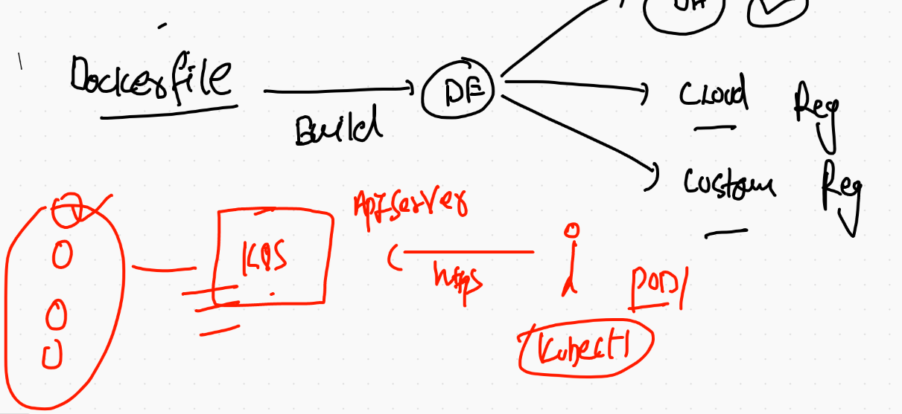

## Installing k8s cluster in VMS/DC/Baremetal -- using kubeadm 

## prerequsite :
===

```
[root@ip-172-31-46-37 ~]# cat setup.sh 
# selinux security off
setenforce  0
sed -i 's/SELINUX=enforcing/SELINUX=disabled/'  /etc/selinux/config

## swap memory also off

swapoff -a

## enable kernel bridge network support 

modprobe br_netfilter
echo '1' > /proc/sys/net/bridge/bridge-nf-call-iptables

#  installing docker & kubeadm 

cat  <<EOF  >/etc/yum.repos.d/kube.repo
[kube]
baseurl=https://packages.cloud.google.com/yum/repos/kubernetes-el7-x86_64
gpgcheck=0
EOF

yum  install kubeadm  docker -y 

## starting docker & kubelet daemon 

systemctl start docker  kubelet 
systemctl enable  docker  kubelet 

```


## you can set hostname accordinly if required 

##  Now time to deploy master node component 

### use my github link :  https://github.com/reashu/k8s 


## Pod deployment 

```
❯ kubectl  get  po
NAME           READY   STATUS    RESTARTS   AGE
ashu-pod-1     1/1     Running   0          93s
manju-pod-1    1/1     Running   0          36s
sam-pod-2      1/1     Running   0          31s
venkat-pod-1   1/1     Running   0          16s
❯ 
❯ kubectl  get  nodes
NAME            STATUS   ROLES                  AGE   VERSION
master-node     Ready    control-plane,master   29m   v1.20.2
minion-node-1   Ready    <none>                 28m   v1.20.2
minion-node-2   Ready    <none>                 28m   v1.20.2
minion-node-3   Ready    <none>                 28m   v1.20.2
❯ kubectl  get  po   -o wide
NAME           READY   STATUS    RESTARTS   AGE     IP               NODE            NOMINATED NODE   READINESS GATES
ashu-pod-1     1/1     Running   0          3m21s   192.168.97.65    minion-node-2   <none>           <none>
manju-pod-1    1/1     Running   0          2m24s   192.168.97.66    minion-node-2   <none>           <none>
sam-pod-2      1/1     Running   0          2m19s   192.168.138.66   minion-node-1   <none>           <none>
venkat-pod-1   1/1     Running   0          2m4s    192.168.97.67    minion-node-2   <none>           <none>

```

## accessing application running in the pod using kubectl port-forward

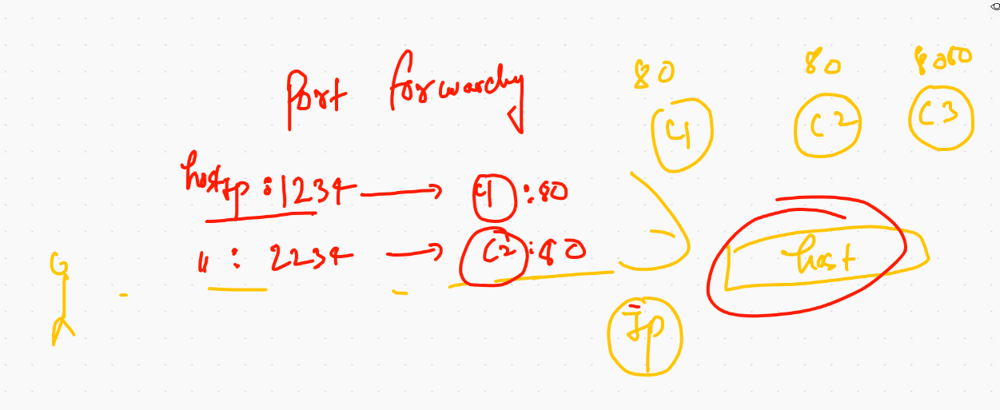

## intro to service in k8s

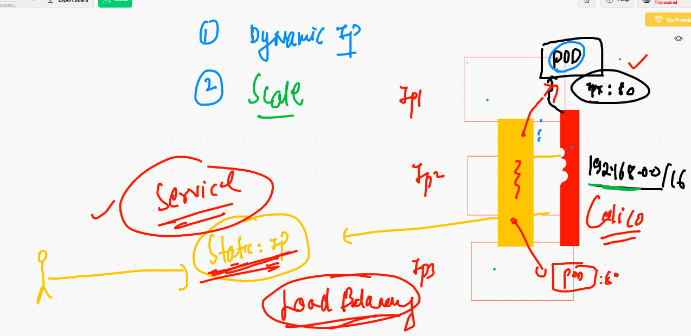

## service find pod using label 

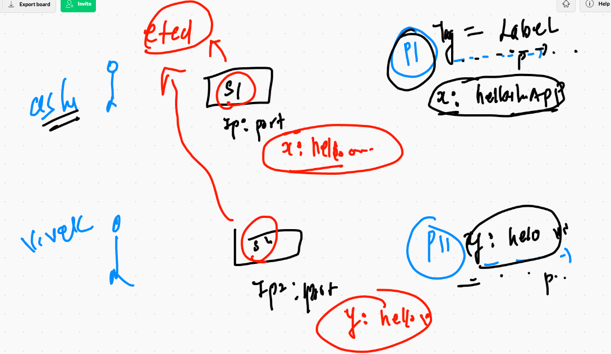

## type fo service in k8s

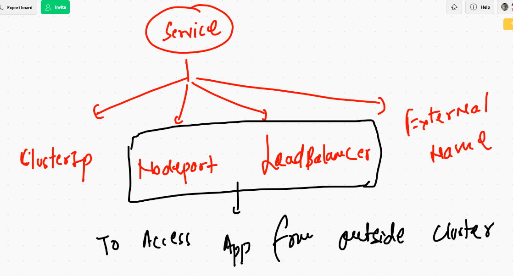

## nodeport service 

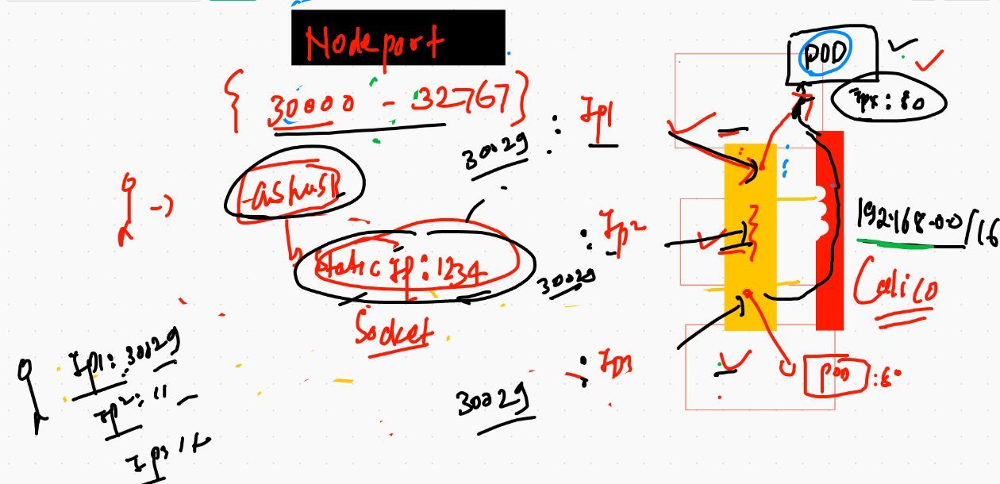

## explain nodeport 

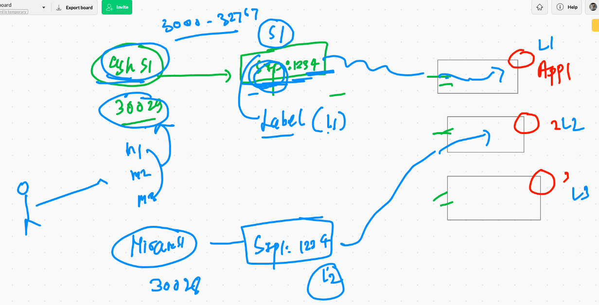

## Deploy / update label of pod 

```
apiVersion: v1 # this is api version for pod 
kind: Pod # requesting api server about Pod 
metadata:
 name: ashu-pod-1 # name of POD
 labels: # to define label 
  x: helloashu #  label must be in a key: value format 
spec:
 containers: # here will write about container from any CRE
 - image: nginx # image from docker hub 
   name: ashuc1 # name of container 
   ports:  # port of application in side container 
   - containerPort: 80  
   
 ```
 
 ## checking labels 
 
 ```
 ❯ kubectl get po  --show-labels
NAME           READY   STATUS    RESTARTS   AGE   LABELS
ashu-pod-1     1/1     Running   0          47m   x=helloashu
manju-pod-1    1/1     Running   0          66m   <none>
niran-pod-1    1/1     Running   0          61m   <none>
sam-pod-2      1/1     Running   0          66m   run=sam-pod-2
sat-2          1/1     Running   0          62m   x=satlab1
suresh-pod-1   1/1     Running   0          60m   <none>

```

## creating nodeport service 

```
❯ kubectl create  service  nodeport ashus1 --tcp 1234:80   --dry-run=client -o yaml
apiVersion: v1
kind: Service
metadata:
  creationTimestamp: null
  labels:
    app: ashus1
  name: ashus1
spec:
  ports:
  - name: 1234-80
    port: 1234
    protocol: TCP
    targetPort: 80
  selector:
    app: ashus1
  type: NodePort
status:
  loadBalancer: {}
❯ kubectl create  service  nodeport ashus1 --tcp 1234:80   --dry-run=client -o yaml   >ashusvc1.yaml

```

## Lets deploy one more pod with service in single file


```

apiVersion: v1
kind: Pod
metadata:
  creationTimestamp: null
  labels:
    run: ashuwebapp  # label of pod 
  name: ashuwebapp
spec:
  containers:
  - image: dockerashu/httpd:oraclejan2021v1
    name: ashuwebapp
    ports:
    - containerPort: 80
    resources: {}
  dnsPolicy: ClusterFirst
  restartPolicy: Always
status: {}

---   #  seperator between two api resource type 
apiVersion: v1
kind: Service
metadata:
  creationTimestamp: null
  labels:
    app: ashus2
  name: ashus2
spec:
  ports:
  - name: 1234-80
    port: 1234
    protocol: TCP
    targetPort: 80
  selector: # finder needs to have same label of pod 
    run: ashuwebapp
  type: NodePort
status:
  loadBalancer: {}


```

##

```
❯ kubectl create service   nodeport ashus2  --tcp  1234:80 --dry-run=client -o yaml  >>finalpod.yml
❯ kubectl apply -f finalpod.yml
pod/ashuwebapp created
❯ kubectl apply -f finalpod.yml
pod/ashuwebapp configured
service/ashus2 created
❯ kubectl get po
NAME           READY   STATUS    RESTARTS   AGE
ashuwebapp     1/1     Running   0          51s
manju-pod-1    1/1     Running   0          10m
niran-pod-1    1/1     Running   0          11m
sat-pod-1      1/1     Running   0          10m
satpod2        1/1     Running   0          9m12s
suresh-pod-1   1/1     Running   0          11m
venkat-pod-1   1/1     Running   0          10m
vivek-pod-1    1/1     Running   0          10m
❯ kubectl get po ashuwebapp --show-labels
NAME         READY   STATUS    RESTARTS   AGE   LABELS
ashuwebapp   1/1     Running   0          61s   run=ashuwebapp
❯ kubectl get  svc
NAME            TYPE        CLUSTER-IP       EXTERNAL-IP   PORT(S)          AGE
ashus2          NodePort    10.110.137.15    <none>        1234:31676/TCP   42s
kubernetes      ClusterIP   10.96.0.1        <none>        443/TCP          12m
manju1          NodePort    10.107.181.5     <none>        7001:31185/TCP   10m
niran1          NodePort    10.107.55.80     <none>        3456:31594/TCP   11m
samnodeports1   NodePort    10.109.42.24     <none>        1234:31141/TCP   10m
sats1           NodePort    10.100.33.174    <none>        1239:32095/TCP   7m49s
suresh2         NodePort    10.99.118.213    <none>        1234:32266/TCP   11m
vensrvc1        NodePort    10.110.79.33     <none>        1234:32145/TCP   9m42s
viveks1         NodePort    10.102.129.234   <none>        1235:32448/TCP   11m
❯ kubectl get  svc  -o wide
NAME            TYPE        CLUSTER-IP       EXTERNAL-IP   PORT(S)          AGE     SELECTOR
ashus2          NodePort    10.110.137.15    <none>        1234:31676/TCP   53s     run=ashuwebapp
kubernetes      ClusterIP   10.96.0.1        <none>        443/TCP          12m     <none>
manju1          NodePort    10.107.181.5     <none>        7001:31185/TCP   10m     x=hellomanju
niran1          NodePort    10.107.55.80     <none>        3456:31594/TCP   11m     my=mylabel
samnodeports1   NodePort    10.109.42.24     <none>        1234:31141/TCP   10m     dev=sam-pod-1
sats1           NodePort    10.100.33.174    <none>        1239:32095/TCP   8m      x=satlabel1
suresh2         NodePort    10.99.118.213    <none>        1234:32266/TCP   11m     x=suresh1
vensrvc1        NodePort    10.110.79.33     <none>        1234:32145/TCP   9m53s   app=vensrvc1
viveks1         NodePort    10.102.129.234   <none>        1235:32448/TCP   11m     true=vivekservice

```


## END USER VIEW TO APP ON K8S 

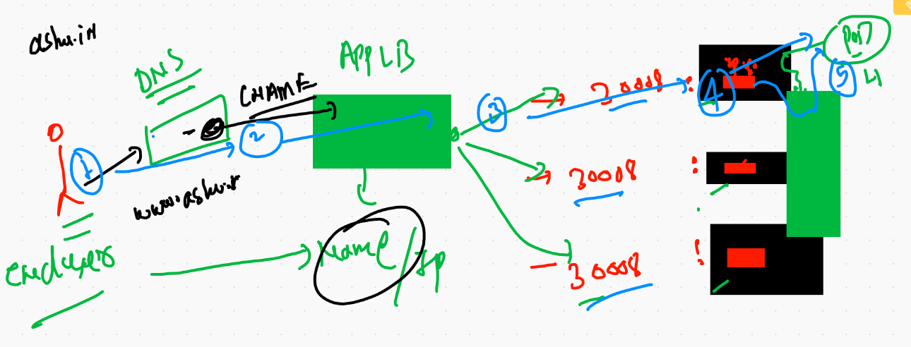

## Pods in More detailed way  with security and troubleshooting 

## creating alpine pod 

```
kubectl run  ashupod1 --image=alpine --dry-run=client -o yaml >alp.yml
```

## error check 

```
❯ kubectl apply -f alp.yml
pod/ashupod1 created
❯ kubectl  get  po
NAME       READY   STATUS             RESTARTS   AGE
ashupod1   0/1     ImagePullBackOff   0          5s
❯ kubectl  describe   po ashupod1
Name:         ashupod1
Namespace:    default
Priority:     0
Node:         minion-node-2/172.31.44.252
Start Time:   Thu, 28 Jan 2021 12:41:25 +0530
Labels:       run=ashupod1
Annotations:  cni.projectcalico.org/podIP: 192.168.97.75/32
              cni.projectcalico.org/podIPs: 192.168.97.75/32
Status:       Pending
IP:           192.168.97.75
IPs:
  IP:  192.168.97.75
Containers:
  ashupod1:
    Container ID:   
    Image:          alpinee
    Image ID:       
    Port:           <none>

```

## error troubleshooting options 

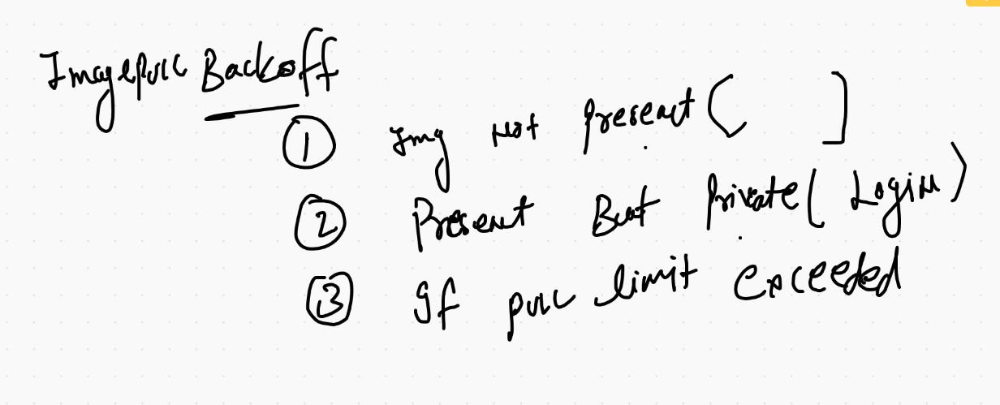

## crashloopbackoff / completed error solving 

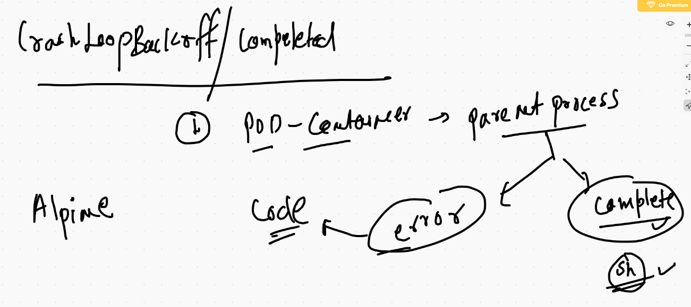

## more useful commands

```
 4750  kubectl  logs  ashupod1 
 4751  kubectl  logs  ashupod1  -f
❯ kubectl exec -it ashupod1  -- sh
/ # 
/ # 
/ # cat  /etc/os-release 
NAME="Alpine Linux"
ID=alpine
VERSION_ID=3.13.0
PRETTY_NAME="Alpine Linux v3.13"
HOME_URL="https://alpinelinux.org/"
BUG_REPORT_URL="https://bugs.alpinelinux.org/"
/ # ps -e
PID   USER     TIME  COMMAND
    1 root      0:00 ping 8.8.8.8
    6 root      0:00 sh
   12 root      0:00 ps -e
/ # 


```


## application and pod security 

### limiting resource in k8s 

```
apiVersion: v1
kind: Pod
metadata:
  creationTimestamp: null
  labels:
    run: ashupod1
  name: ashupod1
spec:
  containers:
  - image: alpine  # name of image 
    name: ashupod1 # name of container
    command: ["/bin/sh","-c","ping 8.8.8.8"] # parent process of container 
    resources:
     requests: # request resource for this container only
      memory: "100Mi"
      cpu: "250m"
     limits:  # the max container can use 
      memory: "256Mi"  # MiB
      cpu: "500m" # mili core 
  dnsPolicy: ClusterFirst
  restartPolicy: Always
status: {}

```

## pod limits 

[limits] ('https://kubernetes.io/docs/concepts/configuration/manage-resources-containers/')


# namespace in k8s

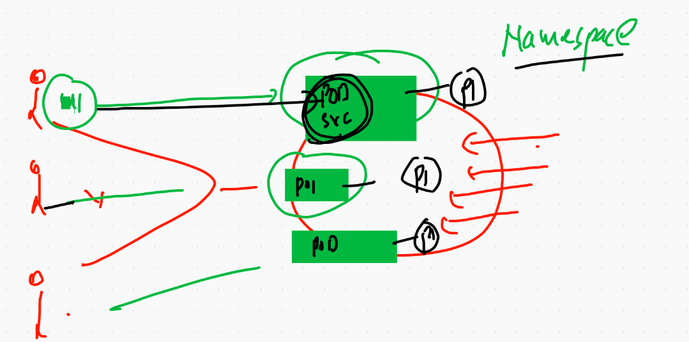

## checking default namespaces

```
❯ kubectl get namespace
NAME              STATUS   AGE
default           Active   4h44m
kube-node-lease   Active   4h44m
kube-public       Active   4h44m
kube-system       Active   4h44m
```

## kube-system namespace 

```
 kubectl get  po  -n kube-system
NAME                                       READY   STATUS    RESTARTS   AGE
calico-kube-controllers-744cfdf676-m2266   1/1     Running   0          4h43m
calico-node-mr9bf                          1/1     Running   0          4h43m
calico-node-pkzq5                          1/1     Running   0          4h43m
calico-node-q894l                          1/1     Running   0          4h43m
calico-node-x757q                          1/1     Running   0          4h43m
coredns-74ff55c5b-hv7fx                    1/1     Running   0          4h45m
coredns-74ff55c5b-nr7r5                    1/1     Running   0          4h45m
etcd-master-node                           1/1     Running   0          4h46m
kube-apiserver-master-node                 1/1     Running   0          4h46m
kube-controller-manager-master-node        1/1     Running   0          4h46m
kube-proxy-58fpx                           1/1     Running   0          4h44m
kube-proxy-7mvc9                           1/1     Running   0          4h45m
kube-proxy-kbm66                           1/1     Running   0          4h45m
kube-proxy-qpn2m                           1/1     Running   0          4h45m
kube-scheduler-master-node                 1/1     Running   0          4h46m
```

## deploy pod in custom namespace 

```
❯ kubectl apply -f alp.yml  -n ashu-space
pod/ashupod1 created
❯ kubectl  get  po -n ashu-space
NAME       READY   STATUS    RESTARTS   AGE
ashupod1   1/1     Running   0          16s
❯ kubectl  get  po -n ashu-space
NAME       READY   STATUS    RESTARTS   AGE
ashupod1   1/1     Running   0          40s
❯ kubectl delete po ashupod1 -n ashu-space
pod "ashupod1" deleted


```

# Replication controller (RC)

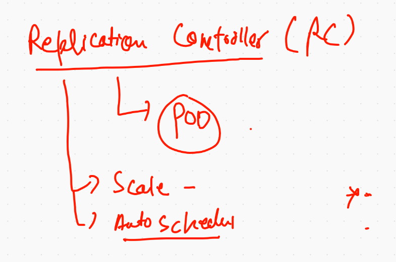

## Replication controller writing 

```
apiVersion: v1
kind: ReplicationController # new api-resource like POD 
metadata:
 namespace: ashu-space  # namespace name 
 name: ashurc111 # name of RC 
spec:
 replicas: 1 # no of pod 
 template: # using template RC will create Pods 
  metadata:
   labels:
    x: helloashuapp1
  spec:
   containers:
   - image: nginx
     name: ashuc1
     ports:
     - containerPort: 80
     
 ```
 
 ## deploying RC 
 
 ```
 ❯ kubectl  apply -f ashurc.yaml
replicationcontroller/ashurc111 created
❯ 
❯ kubectl  get  rc  -n ashu-space
NAME        DESIRED   CURRENT   READY   AGE
ashurc111   1         1         1       9s
❯ kubectl  get  po  -n ashu-space
NAME              READY   STATUS    RESTARTS   AGE
ashupod1          1/1     Running   0          13m
ashurc111-d8d9c   1/1     Running   0          20s

```

## Expose can create a service by automatically matching label of POds 

```
❯ kubectl get  rc -n ashu-space
NAME        DESIRED   CURRENT   READY   AGE
ashurc111   1         1         1       39s
❯ kubectl  expose  rc  ashurc111  --type NodePort --port 1234 --target-port 80 -n ashu-space
service/ashurc111 exposed
❯ kubectl get  svc -n ashu-space
NAME        TYPE       CLUSTER-IP    EXTERNAL-IP   PORT(S)          AGE
ashurc111   NodePort   10.98.149.9   <none>        1234:32686/TCP   9s

```

## scaling RC 

## using command line 

```
 kubectl  scale  rc  ashurc111 --replicas=5 -n ashu-space 
 
```

## updating YAML file 

```
apiVersion: v1
kind: ReplicationController # new api-resource like POD 
metadata:
 namespace: ashu-space  # namespace name 
 name: ashurc111 # name of RC 
spec:
 replicas: 2 # no of pod 
 template: # using template R
 
```

## Deploymentin k8s 

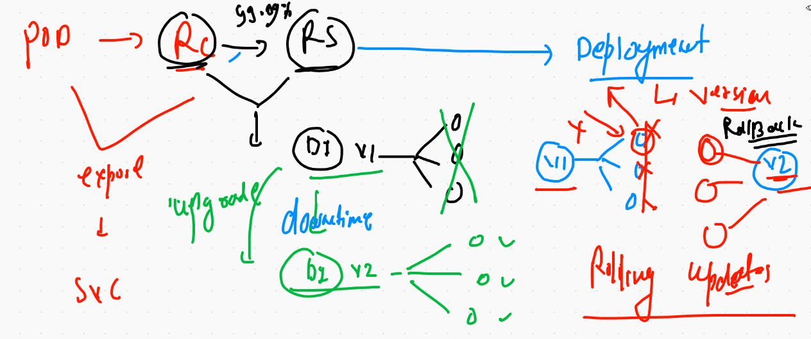

