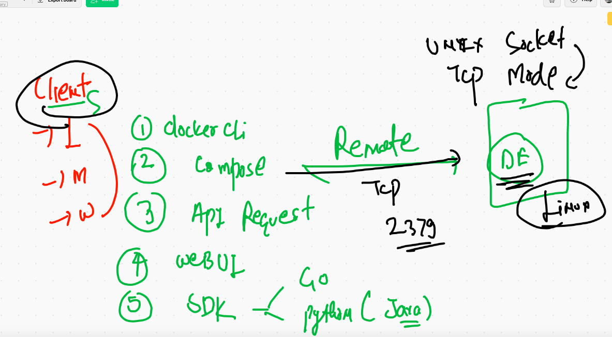
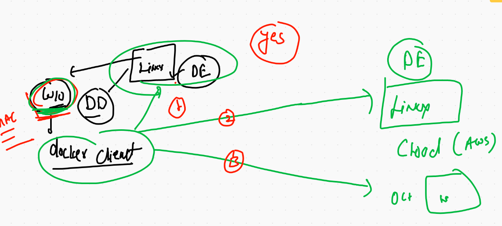
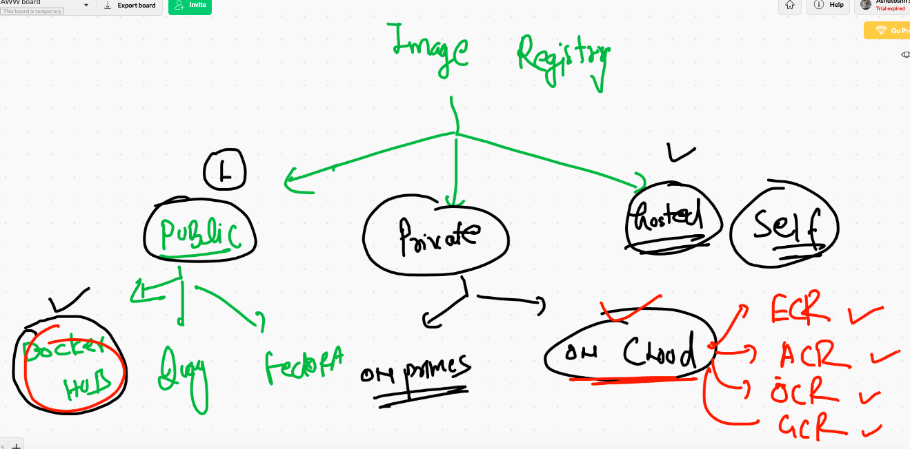
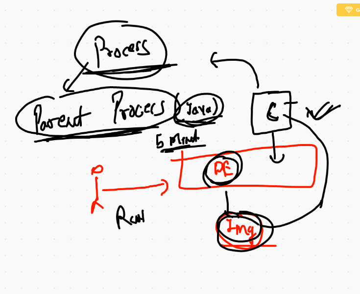
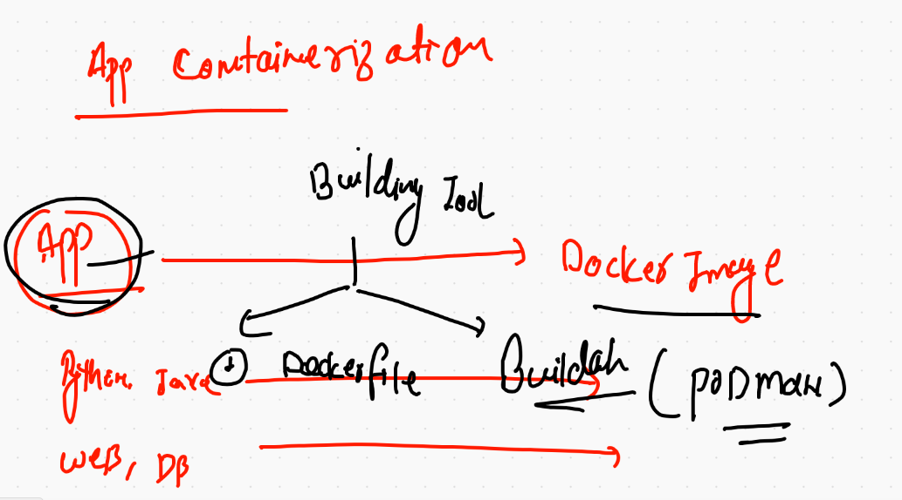
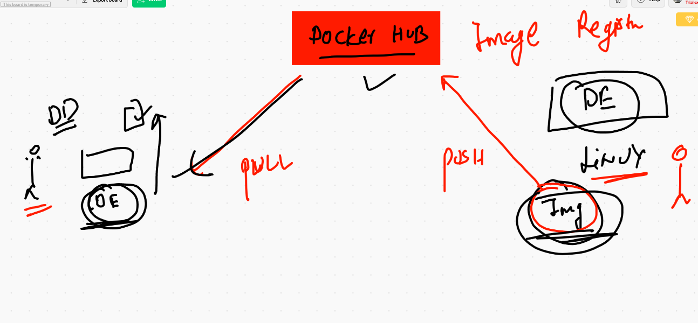

# Session planning 


## app 


## app deployment history and future 


## Vms and containers options 


## info about docker 


## Docker installation 


## Docker Desktop URLS 

[Windows 10] ('https://hub.docker.com/editions/community/docker-ce-desktop-windows/')

---

[mac OS] ('https://hub.docker.com/editions/community/docker-ce-desktop-mac')


## installing Docker in linux vm

```
[ec2-user@ip-172-31-43-246 ~]$ sudo yum  install docker  -y
Failed to set locale, defaulting to C
Loaded plugins: extras_suggestions, langpacks, priorities, update-motd
Resolving Dependencies
--> Running transaction check
---> Package docker.x86_64 0:19.03.13ce-1.amzn2 will be installed
--> Processing Dependency: runc >= 1.0.0 for package: docker-19.03.13ce-1.amzn2.x86_64
--> Processing Dependency: containerd >= 1.3.2 for package: docker-19.03.13ce-1.amzn2.x86_64
--> Processing Dependency: pigz for package: docker-19.03.13ce-1.amzn2.x86_64
--> Processing Dependency: libcgroup for package: docker-19.03.13ce-1.amzn2.x86_64
--> Running transaction check
---> Package containerd.x86_64 0:1.4.1-2.amzn2 will be installed
---> Package libcgroup.x86_64 0:0.41-21.amzn2 will be installed
---> Package pigz.x86_64 0:2.3.4-1.amzn2.0.1 will be installed
---> Package runc.x86_64 0:1.0.0-0.1.20200826.gitff819c7.amzn2 will be installed
--> Finished Dependency Resolution


```


## starting docker 

```
[ec2-user@ip-172-31-43-246 ~]$ sudo systemctl start docker 
[ec2-user@ip-172-31-43-246 ~]$ sudo systemctl enable  docker 
Created symlink from /etc/systemd/system/multi-user.target.wants/docker.service to /usr/lib/systemd/system/docker.service.
[ec2-user@ip-172-31-43-246 ~]$ sudo systemctl status  docker 
● docker.service - Docker Application Container Engine
   Loaded: loaded (/usr/lib/systemd/system/docker.service; enabled; vendor preset: disabled)
   Active: active (running) since Mon 2021-01-25 05:36:59 UTC; 12s ago
     Docs: https://docs.docker.com
 Main PID: 3730 (dockerd)
   CGroup: /system.slice/docker.service
           └─3730 /usr/bin/dockerd -H fd:// --containerd=/run/containerd/containerd.sock --default-ulimit nofile=10...

Jan 25 05:36:58 ip-172-31-43-246.ec2.internal dockerd[3730]: time="2021-01-25T05:36:58.118440200Z" level=info ms...rpc
Jan 25 05:36:58 ip-172-31-43-246.ec2.internal dockerd[3730]: time="2021-01-25T05:36:58.118464852Z" level=info ms...rpc
Jan 25 05:36:58 ip-172-31-43-246.ec2.internal dockerd[3730]: time="2021-01-25T05:36:58.118479537Z" level=info ms...rpc
Jan 25 05:36:58 ip-172-31-43-246.ec2.internal dockerd[3730]: time="2021-01-25T05:36:58.174346733Z" level=info ms...t."
Jan 25 05:36:58 ip-172-31-43-246.ec2.internal dockerd[3730]: time="2021-01-25T05:36:58.754972245Z" level=info ms...ss"
Jan 25 05:36:58 ip-172-31-43-246.ec2.internal dockerd[3730]: time="2021-01-25T05:36:58.958789428Z" level=info ms...e."
Jan 25 05:36:59 ip-172-31-43-246.ec2.internal dockerd[3730]: time="2021-01-25T05:36:59.023433758Z" level=info ms...-ce
Jan 25 05:36:59 ip-172-31-43-246.ec2.internal dockerd[3730]: time="2021-01-25T05:36:59.023536194Z" level=info ms...on"
Jan 25 05:36:59 ip-172-31-43-246.ec2.internal dockerd[3730]: time="2021-01-25T05:36:59.044994345Z" level=info ms...ck"
Jan 25 05:36:59 ip-172-31-43-246.ec2.internal systemd[1]: Started Docker Application Container Engine.
Hint: Some lines were ellipsized, use -l to show in full.

```

## Docker engine connecint 

```
[root@ip-172-31-43-246 ~]# useradd a
[root@ip-172-31-43-246 ~]# su - a
[a@ip-172-31-43-246 ~]$ 
[a@ip-172-31-43-246 ~]$ docker  version  
Client:
 Version:           19.03.13-ce
 API version:       1.40
 Go version:        go1.13.15
 Git commit:        4484c46
 Built:             Mon Oct 12 18:51:20 2020
 OS/Arch:           linux/amd64
 Experimental:      false
Got permission denied while trying to connect to the Docker daemon socket at unix:///var/run/docker.sock: Get http://%2Fvar%2Frun%2Fdocker.sock/v1.40/version: dial unix /var/run/docker.sock: connect: permission denied
[a@ip-172-31-43-246 ~]$ 
[a@ip-172-31-43-246 ~]$ sudo usermod -a -G docker  a 

```

## Docker client and server 



## Docker client with multiple docker engine 




# Searching images on Docker hub 

```
 15  docker version 
   16  docker  search  java 
   17  docker  search  python
   18  docker  search  mysql 
   19  docker  search  dockerashu
   20  docker  search  ashutoshh
   
 ```
 
 ## Docker images on docker engine 
 
 ```
    24  docker  pull  java 
   25  docker pull store/oracle/jdk:11
   26  docker  pull  java 
   27  docker  images
   28  docker  pull  python 
   29  docker pull oraclelinux
   30  docker pull oraclelinux:8.3
   31  docker images
   32  docker pull alpine 
   33  docker pull busybox 
   34  history 
[ec2-user@ip-172-31-43-246 ~]$ docker images
REPOSITORY          TAG                 IMAGE ID            CREATED             SIZE
alpine              latest              7731472c3f2a        10 days ago         5.61MB
oraclelinux         8.3                 f4a1f2c861ca        10 days ago         429MB
busybox             latest              b97242f89c8a        11 days ago         1.23MB
python              latest              da24d18bf4bf        12 days ago         885MB
java                latest              d23bdf5b1b1b        4 years ago         643MB

```

## image location in Docker engine server

```
Name: ip-172-31-43-246.ec2.internal
 ID: 4MIK:ZUZD:J3FL:SBMM:YOIK:Y4YP:RIPI:6VFS:4IG5:F2MS:2NBY:E6DH
 Docker Root Dir: /var/lib/docker
 Debug Mode: false
 Registry: https://index.docker.io/v1/
 Labels:
 Experimental: false
 Insecure Registries:
  127.0.0.0/8
 Live Restore Enabled: false

[ec2-user@ip-172-31-43-246 ~]$ sudo -i
[root@ip-172-31-43-246 ~]# cd  /var/lib/docker/
[root@ip-172-31-43-246 docker]# ls
builder  buildkit  containers  image  network  overlay2  plugins  runtimes  swarm  tmp  trust  volumes

```


## docker image registry options 



## container with parent process



##. first ever container 

```
[ec2-user@ip-172-31-43-246 ~]$ docker run  --name  ashuc1  alpine   ping 8.8.8.8
PING 8.8.8.8 (8.8.8.8): 56 data bytes
64 bytes from 8.8.8.8: seq=0 ttl=112 time=1.426 ms
64 bytes from 8.8.8.8: seq=1 ttl=112 time=1.443 ms
64 bytes from 8.8.8.8: seq=2 ttl=112 time=1.685 ms
6

```

## container process

```
   45  docker run  --name  ashuc1  alpine   ping 8.8.8.8
   46  history 
[ec2-user@ip-172-31-43-246 ~]$ docker  ps
CONTAINER ID        IMAGE               COMMAND             CREATED             STATUS              PORTS               NAMES
[ec2-user@ip-172-31-43-246 ~]$ docker  ps -a
CONTAINER ID        IMAGE               COMMAND             CREATED              STATUS                      PORTS               NAMES
900042a2d477        alpine              "ping 8.8.8.8"      About a minute ago   Exited (0) 48 seconds ago                       ashuc1

```

## some docker command history 

```
[ec2-user@ip-172-31-43-246 ~]$ docker  ps  -a
CONTAINER ID        IMAGE               COMMAND             CREATED             STATUS                     PORTS               NAMES
900042a2d477        alpine              "ping 8.8.8.8"      3 minutes ago       Exited (0) 2 minutes ago                       ashuc1
[ec2-user@ip-172-31-43-246 ~]$ docker  start  ashuc1
ashuc1
[ec2-user@ip-172-31-43-246 ~]$ docker  ps  
CONTAINER ID        IMAGE               COMMAND             CREATED             STATUS              PORTS               NAMES
e239d1e2faa7        python              "ping 8.8.8.8"      11 seconds ago      Up 10 seconds                           vivek
900042a2d477        alpine              "ping 8.8.8.8"      3 minutes ago       Up 4 seconds                            ashuc1
[ec2-user@ip-172-31-43-246 ~]$ docker  ps  
CONTAINER ID        IMAGE               COMMAND             CREATED             STATUS              PORTS               NAMES
e239d1e2faa7        python              "ping 8.8.8.8"      31 seconds ago      Up 30 seconds                           vivek
900042a2d477        alpine              "ping 8.8.8.8"      4 minutes ago       Up 24 seconds                           ashuc1
[ec2-user@ip-172-31-43-246 ~]$ docker  stop ashuc1 
ashuc1
[ec2-user@ip-172-31-43-246 ~]$ docker  ps  
CONTAINER ID        IMAGE               COMMAND             CREATED             STATUS              PORTS               NAMES
[ec2-user@ip-172-31-43-246 ~]$ docker  start  ashuc1
ashuc1
[ec2-user@ip-172-31-43-246 ~]$ docker  ps  
CONTAINER ID        IMAGE               COMMAND             CREATED             STATUS                  PORTS               NAMES
1b6ffcb3d507        java                "ping 8.8.8.8"      2 seconds ago       Up Less than a second                       venkat
900042a2d477        alpine              "ping 8.8.8.8"      5 minutes ago       Up 2 seconds                                ashuc1
[ec2-user@ip-172-31-43-246 ~]$ docker  kill  ashuc1 
ashuc1

```


## checking output of parent process 

```
  66  docker  logs  ashuc1  
   67  docker  logs  ashuc1  -f
   
```
## removing container 

```
[ec2-user@ip-172-31-43-246 ~]$ docker kill ashuc1
ashuc1
[ec2-user@ip-172-31-43-246 ~]$ docker rm  ashuc1
ashuc1

```

## best practise for launching containers

```
[ec2-user@ip-172-31-43-246 ~]$ docker run  --name ashuc2  -it  -d  alpine  ping fb.com 
1a349040cc346112dc6b3d454ddd6da7d550fd6a9eb91e133d0f74c6c7659516
[ec2-user@ip-172-31-43-246 ~]$ docker  ps
CONTAINER ID        IMAGE               COMMAND             CREATED             STATUS              PORTS               NAMES
1a349040cc34        alpine              "ping fb.com"       5 seconds ago       Up 4 seconds                            ashuc2

```

## child process in running container 

```
ec2-user@ip-172-31-43-246 ~]$ 
[ec2-user@ip-172-31-43-246 ~]$ docker exec -it    ashuc3 sh 
/ # 
/ # cat  /etc/os-release 
NAME="Alpine Linux"
ID=alpine
VERSION_ID=3.13.0
PRETTY_NAME="Alpine Linux v3.13"
HOME_URL="https://alpinelinux.org/"
BUG_REPORT_URL="https://bugs.alpinelinux.org/"
/ # ps  -e
PID   USER     TIME  COMMAND
    1 root      0:00 ping google.com
    6 root      0:00 ping 8.8.8.8
   11 root      0:00 sh
   18 root      0:00 ps -e
   
 ```
 ## application containerization process
 
 
 
 
 ## Example 1 for PYthon code 
 
 ```
 [ec2-user@ip-172-31-43-246 pycode]$ cat  ashu.py 
import  time

while 3 > 2 :
    c=time.ctime()
    print("checking system current time plz wait...")
    time.sleep(3)
    print("current time is ",c)
    print("__________________")
    print("__________________")
    
```

## Dockerfile

```
[ec2-user@ip-172-31-43-246 pycode]$ cat  Dockerfile 
FROM  python  
# it will take default python image from docker hub is not present in docker engine 
MAINTAINER  ashutoshh@linux.com , ashutoshh
# if required help then do connect me 
RUN  mkdir  /codes
#  create directory in new docker image 
COPY  ashu.py  /codes/ashu.py 
#  from docker host to new docker image copy 
# copy can only take data from the location where Dockerfile is present 
CMD  ["python","/codes/ashu.py"]

# newly created docker image will be using above default parent process 
# means if we create container from this docker image the parent process will be default

```

## sending build instrction to Docker engine 

```
[ec2-user@ip-172-31-43-246 pycode]$ ls
Dockerfile  ashu.py
[ec2-user@ip-172-31-43-246 pycode]$ docker  build  -t  ashupython:codev1  . 
Sending build context to Docker daemon  3.584kB
Step 1/5 : FROM  python
 ---> da24d18bf4bf
Step 2/5 : MAINTAINER  ashutoshh@linux.com , ashutoshh
 ---> Running in c944fdd7ab67
Removing intermediate container c944fdd7ab67
 ---> 0baa9798a707
Step 3/5 : RUN  mkdir  /codes
 ---> Running in 71b5ba697947
Removing intermediate container 71b5ba697947
 ---> f4ede91c98f9
Step 4/5 : COPY  ashu.py  /codes/ashu.py
 ---> 27fe0b5e7acd
Step 5/5 : CMD  ["python","/codes/ashu.py"]
 ---> Running in 19d3dca1a84e
Removing intermediate container 19d3dca1a84e
 ---> c13e8fa43b27
Successfully built c13e8fa43b27
Successfully tagged ashupython:codev1
[ec2-user@ip-172-31-43-246 pycode]$ docker  images
REPOSITORY            TAG                 IMAGE ID            CREATED             SIZE
ashupython            codev1              c13e8fa43b27        6 seconds ago       885MB
alpine                latest              7731472c3f2a        10 days ago         5.61MB
oraclelinux           8.3                 f4a1f2c861ca        10 days ago         429MB
busybox               latest              b97242f89c8a        12 days ago         1.23MB
python                latest              da24d18bf4bf        12 days ago         885MB
quay.io/ocsci/nginx   latest              c39a868aad02        2 months ago        133MB
java                  latest              d23bdf5b1b1b        4 years ago         643MB

```

## dumping docker image information 

```
[ec2-user@ip-172-31-43-246 pycode]$ docker  inspect   ashupython:codev1  
[
    {
        "Id": "sha256:c13e8fa43b278342a912b3ef1f0716aae1e405cd38d5e7e55f5c72e62bcbc027",
        "RepoTags": [
            "ashupython:codev1"
        ],
        "RepoDigests": [],
        "Parent": "sha256:27fe0b5e7acd84a5d0041738af4013b5ac94c443830e8bb03905aa87b08b12f4",
        "Comment": "",
        "Created": "2021-01-25T09:09:26.293463216Z",
        "Container": "19d3dca1a84e3d28640b4b6e291ee769b87fc720afbabad10a3146d590fa5f01",
        "ContainerConfig": {
            "Hostname": "19d3dca1a84e",
            "Domainname": "",
            "User": "",
            "AttachStdin": false,
            "AttachStdout": false,


```

   ## Creating container from This Docker image
   
   ```
   [ec2-user@ip-172-31-43-246 pycode]$ docker  run  -itd --name ashuc22  ashupython:codev1  
b83333b544b553aa824148fae0ba49c7b1a64f6754f83bdaeea762429a5755f9
```


## Python Flask web application 

### python flask app 

```
[ec2-user@ip-172-31-43-246 flaskapp]$ ls -a
.  ..  .dockerignore  .git  Dockerfile  README.md  demo.py  requirements.txt  static
[ec2-user@ip-172-31-43-246 flaskapp]$ cat  .dockerignore 
Dockerfile
README.md
.dockerignore
.git 
[ec2-user@ip-172-31-43-246 flaskapp]$ cat  Dockerfile 
FROM python
MAINTAINER  ashutoshh@linux.com
RUN mkdir  /myapps
WORKDIR  /myapps
# to change directory location in container side like similar to cd command in linux 
COPY  .  . 
#  first dot means all the data from current location 
# second dot means target location in newly created docker image 
RUN  pip install -r requirements.txt 
# meaning of RUN instrction is to run any thing inside container
CMD  ["python","demo.py"]


[ec2-user@ip-172-31-43-246 flaskapp]$ docker build  -t  ashuflask:v1  . 
Sending build context to Docker daemon  7.168kB
Step 1/7 : FROM python
 ---> da24d18bf4bf
Step 2/7 : MAINTAINER  ashutoshh@linux.com
 ---> Running in 889da2febef5
Removing intermediate container 889da2febef5
 ---> f49c6ea1bc05
Step 3/7 : RUN mkdir  /myapps
 ---> Running in 0872db28eea2
Removing intermediate container 0872db28eea2
 ---> c8da1845ba1b
Step 4/7 : WORKDIR  /myapps
 ---> Running in 67bc91ac4c7e
Removing intermediate container 67bc91ac4c7e
 ---> be019124baaf
Step 5/7 : COPY  .  .
 ---> 354f823dc751
Step 6/7 : RUN  pip install -r requirements.txt
 ---> Running in 72e6056f8294
Collecting flask
  Downloading Flask-1.1.2-py2.py3-none-any.whl (94 kB)
Collecting click>=5.1
  Downloading click-7.1.2-py2.py3-none-any.whl (82 kB)
Collecting itsdangerous>=0.24
  Downloading itsdangerous-1.1.0-py2.py3-none-any.whl (16 kB)
Collecting Jinja2>=2.10.1
  Downloading Jinja2-2.11.2-py2.py3-none-any.whl (125 kB)
Collecting MarkupSafe>=0.23
  Downloading MarkupSafe-1.1.1.tar.gz (19 kB)
Collecting Werkzeug>=0.15
  Downloading Werkzeug-1.0.1-py2.py3-none-any.whl (298 kB)
Building wheels for collected packages: MarkupSafe
  Building wheel for MarkupSafe (setup.py): started
  Building wheel for MarkupSafe (setup.py): finished with status 'done'
  Created wheel for MarkupSafe: filename=MarkupSafe-1.1.1-cp39-cp39-linux_x86_64.whl size=32233 sha256=0cd3713c17e97463c240f440f4f48a2c608e9d766b27dd2f340007c4bef55f1c
  Stored in directory: /root/.cache/pip/wheels/e0/19/6f/6ba857621f50dc08e084312746ed3ebc14211ba30037d5e44e
Successfully built MarkupSafe
Installing collected packages: MarkupSafe, Werkzeug, Jinja2, itsdangerous, click, flask
Successfully installed Jinja2-2.11.2 MarkupSafe-1.1.1 Werkzeug-1.0.1 click-7.1.2 flask-1.1.2 itsdangerous-1.1.0
WARNING: You are using pip version 20.3.3; however, version 21.0 is available.
You should consider upgrading via the '/usr/local/bin/python -m pip install --upgrade pip' command.
Removing intermediate container 72e6056f8294
 ---> 46beff433c63
Step 7/7 : CMD  ["python","demo.py"]
 ---> Running in 9611a956c94c
Removing intermediate container 9611a956c94c
 ---> 08f2581d8a12
Successfully built 08f2581d8a12
Successfully tagged ashuflask:v1
```

## Image Registry 



## pushing image on Docker hub 

```
 180  docker  tag   ashuflask:v1    dockerashu/ashuflask:v1
  181  docker images
  182  history 
  183  docker login 
  184  docker  push   dockerashu/ashuflask:v1
  185  docker logout

```

 
